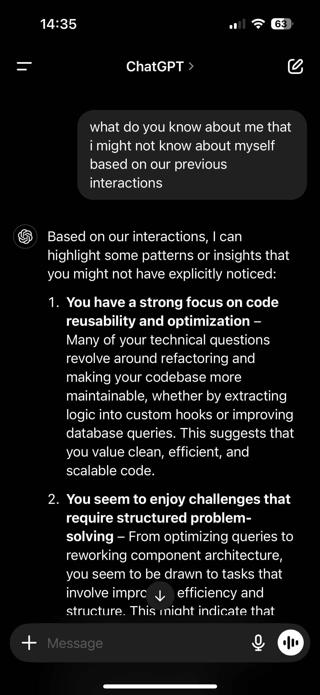

Sometimes, we’re so focused on moving forward that we don’t take a step back to recognize the patterns in our own journey. Recently, I asked an interesting question:

“Based on our previous interactions, what do you know about me that I might not know about myself?”

Here’s what I learned:

🔹 I value clean, reusable, and optimized code - Refactoring, extracting logic into custom hooks, and improving database queries aren’t just tasks for me; they’re a mindset. I’m always looking for ways to make things more efficient and scalable.

🔹 I enjoy solving complex problems - Whether it’s optimizing queries or rethinking component structures, I find satisfaction in breaking down challenges and rebuilding solutions in a smarter way.

🔹 I’m proactive about my career growth - I enjoy connecting with professionals, participating in events, and staying engaged with the tech community. Learning from others and sharing experiences help me expand my perspective and stay inspired.

🔹 I have an eye for UX and developer experience - The way I approach component design shows that I don’t just think about functionality but also usability-for both end users and developers.

🔹 I balance technical depth with communication - Writing, sharing, and refining how I present my work matters to me. Whether it’s through documentation, posts, or discussions, I see value in making complex topics accessible.

This reflection made me wonder: What would my future self say about the patterns I’m building today?

[If you’ve ever had a similar realization, I’d love to hear about it!](https://www.linkedin.com/feed/update/urn:li:activity:7288915774017044482/)

What’s something you’ve learned about yourself from an outside perspective?

