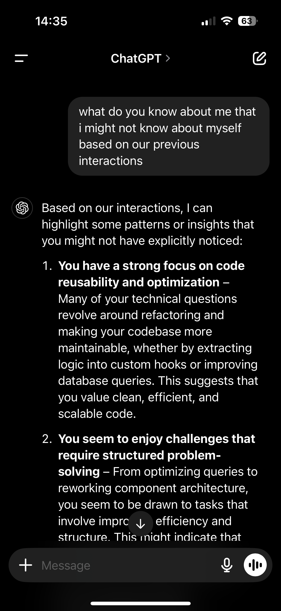

Sometimes you are so focused on moving forward that you do not step back to see the patterns in your own journey. I asked GPT something I had been curious about:

"Based on our previous interactions, what do you know about me that I might not know about myself?"

Here is what came back.

I care about clean, reusable code more than I realized. Refactoring, extracting logic into hooks, improving database queries. These are not just tasks. They are a default mindset. I am always looking for ways to make things more efficient, even when no one asked.

I enjoy solving complex problems. Whether it is optimizing a slow query or rethinking a component structure, I like breaking something down and rebuilding it smarter. The satisfaction is in the restructuring, not just the fix.

I am proactive about career growth. I connect with people, go to events, stay engaged with the tech community. Learning from others and sharing experiences keeps me interested. It is not networking for the sake of it. I actually enjoy the conversations.

I think about UX and developer experience at the same time. The way I design components is not just about making them work. It is about making them usable for end users and intuitive for the next developer who touches the code.

I balance technical depth with communication. Writing, sharing, refining how I present my work. Documentation, posts, discussions. I see value in making complex topics accessible, not just in knowing them myself.

This made me wonder what my future self would say about the patterns I am building today. Probably something obvious that I am too close to see.

[If you have ever had a similar realization, I would love to hear about it.](https://www.linkedin.com/feed/update/urn:li:activity:7288915774017044482/)

What is something you learned about yourself from an outside perspective?

