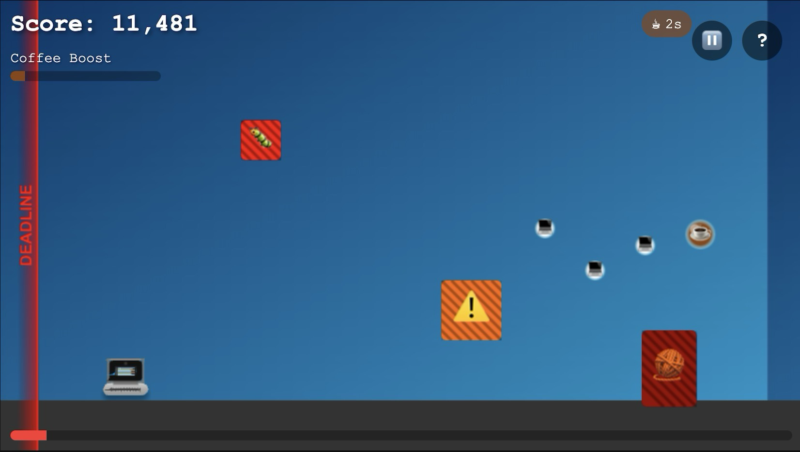

Every developer knows the feeling: racing against deadlines, jumping over bugs, and desperately seeking that next cup of coffee. But what if we could transform these daily experiences into something more entertaining? That's exactly what I set out to do with [**"Mac the Developer"**](https://ngopimas.github.io/mac-the-dev/) - a JavaScript-powered endless runner that turns the software development journey into a gameplay experience.



## From Concept to Canvas: The Developer's Journey

As someone who spends countless hours writing code, I've always found parallels between game design and software development. Both require problem-solving, resource management, and dealing with unexpected challenges. This realization sparked the idea for "Mac the Developer" - a game where these parallels come to life in a way that's both entertaining and relatable to developers everywhere.

The game's core mechanics mirror our daily development experiences:

- Forward progress represents shipping code and meeting milestones
- The approaching deadline (literally chasing you from the left) creates genuine tension
- Coffee power-ups boost productivity (just like in real life!)
- Bugs and merge conflicts serve as obstacles that slow you down
- Technical debt accumulates as physical barriers in your path

## Technical Architecture: Keeping it Pure and Powerful

One of my key decisions was to build the entire game using vanilla JavaScript and HTML5 Canvas. No frameworks, no libraries - just pure JavaScript. This approach not only created a lightweight experience but also served as an excellent exercise.

### The Heart of the Game: A Robust Game Loop

The game's foundation rests on a carefully crafted game loop that ensures smooth animation and consistent gameplay, using a fixed time step approach:

```javascript
gameLoop(timestamp) {
  const deltaTime = timestamp - this.lastFrameTime;
  this.lastFrameTime = timestamp;

  this.accumulatedTime += deltaTime;

  while (this.accumulatedTime >= this.timeStep) {
    if (!this.state.isPaused) {
      this.update(this.timeStep);
    }
    this.accumulatedTime -= this.timeStep;
  }

  this.render();

  if (this.state.isRunning) {
    this.animationFrameId = requestAnimationFrame((timestamp) =>
      this.gameLoop(timestamp)
    );
  }
}
```

This implementation ensures consistent physics calculations by using a fixed time step (targeting 60 FPS), while still allowing the render loop to run as fast as possible. The accumulator pattern prevents physics from breaking during frame rate fluctuations.

### Efficient Collision Detection

The game uses a straightforward but effective collision detection system built on three key components:

1. A base `Sprite` class that manages collision boxes:

```javascript
class Sprite {
  updateCollisionBox() {
    this.collisionBox.x = this.x;
    this.collisionBox.y = this.y;
    this.collisionBox.width = this.width;
    this.collisionBox.height = this.height;
  }

  isCollidingWith(otherSprite) {
    return Utils.checkCollision(this.collisionBox, otherSprite.collisionBox);
  }
}
```

2. Optimized rectangle intersection testing:

```javascript
static checkCollision(rect1, rect2) {
  return (
    rect1.x < rect2.x + rect2.width &&
    rect1.x + rect1.width > rect2.x &&
    rect1.y < rect2.y + rect2.height &&
    rect1.y + rect1.height > rect2.y
  );
}
```

3. Smart collision box adjustments for different states:

```javascript
updateCollisionBox() {
  if (this.state.isSliding) {
    this.collisionBox.x = this.x + 10;
    this.collisionBox.y = this.y + 20;
    this.collisionBox.width = this.width - 20;
    this.collisionBox.height = this.height - 25;
  } else {
    this.collisionBox.x = this.x + 10;
    this.collisionBox.y = this.y + 5;
    this.collisionBox.width = this.width - 20;
    this.collisionBox.height = this.height - 10;
  }
}
```

This system provides precise collision detection while remaining performant, as collision checks are only performed between the player and active game objects.

## Dynamic Difficulty: Keeping Players Engaged

The game features a carefully tuned difficulty progression that adapts to both play time and player performance. The level management system handles this through several mechanisms:

```javascript
updateSpawners(deltaTime) {
  // Calculate game time in seconds
  const gameTimeSeconds = this.distance / this.speed;

  // Reduce obstacle frequency in the first 10 seconds
  const obstacleFrequencyMultiplier = gameTimeSeconds < 10 ? 0.3 : 1.0;

  // Update obstacle timer
  this.obstacleTimer += deltaTime * obstacleFrequencyMultiplier;
  if (this.obstacleTimer >= this.obstacleInterval) {
    this.spawnObstacle();

    // Reset timer with some randomness
    this.obstacleTimer = 0;
    this.obstacleInterval = Utils.randomInt(
      1500 / this.difficulty, // Min interval decreases with difficulty
      3000 / this.difficulty // Max interval decreases with difficulty
    );
  }

  // Increase collectible frequency in the first 15 seconds
  const collectibleFrequencyMultiplier = gameTimeSeconds < 15 ? 2.0 : 1.5;

  // More frequent power-ups early on to help players
  this.collectibleTimer += deltaTime * collectibleFrequencyMultiplier;
}
```

This creates a dynamic experience where:

- New players get a gentler introduction with fewer obstacles
- Power-ups appear more frequently early on to help players learn the mechanics
- The challenge gradually increases as players progress
- Obstacle patterns become more complex at higher difficulties

## Cross-Platform Considerations

Modern web development means supporting a variety of devices and input methods. The game uses a unified input system that handles both traditional keyboard controls and touch inputs:

```javascript
class InputManager {
  constructor() {
    this.setupKeyboardControls();
    this.setupTouchControls();
    this.setupMouseControls();
  }

  setupTouchControls() {
    const canvas = document.getElementById("gameCanvas");
    canvas.addEventListener("touchstart", e => {
      const touch = e.touches[0];
      const touchY = touch.clientY;

      // Simple vertical split for jump/slide zones
      if (touchY < window.innerHeight / 2) {
        this.jump();
      } else {
        this.slide();
      }
    });
  }
}
```

## Lessons Learned and Future Improvements

Building "Mac the Developer" has been an incredible learning experience. Some key takeaways:

1. **Keep It Simple**: Starting with core mechanics and gradually adding features helped maintain code quality
2. **Performance Matters**: Optimizations like spatial partitioning make a huge difference in gameplay smoothness
3. **User Experience First**: Responsive controls and clear feedback are crucial for player engagement
4. **Progressive Enhancement**: Starting with basic functionality and adding polish iteratively helped maintain momentum

Looking ahead, I'm excited to explore:

- Fixing minor bugs and improving gameplay
- Creating levels with different themes
- Optimizing for mobile devices and touch controls
- Adding sound effects and music for a more immersive experience

## Play the Game!

Ready to help Mac outrun deadlines and dodge bugs? [Play Mac the Developer](https://ngopimas.github.io/mac-the-dev/) and see how long you can survive in the demanding world of software development! Feel free to share your high score with me.

## Conclusion

"Mac the Developer" started as a fun way to combine my passion for coding with game development. Whether you're a seasoned developer or just starting your coding journey, I hope this game brings a smile to your face and maybe even helps you see the lighter side of our daily development challenges.

[The complete source code is available on GitHub](https://github.com/Ngopimas/mac-the-dev), and I welcome contributions from the community. After all, what better way to practice your JavaScript skills than by helping to build a game about development itself?

Remember: just like in software development, sometimes the best way to handle a bug is to jump over it! 🐛
