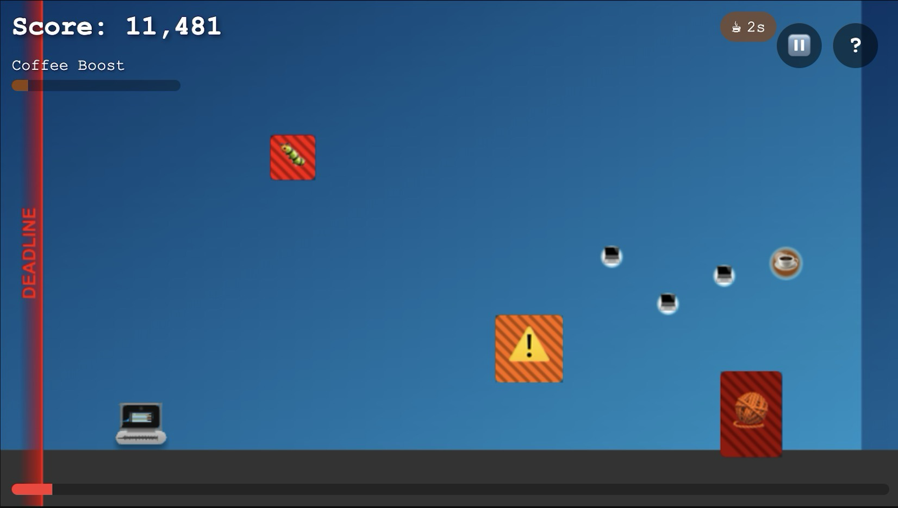

I built [**Mac the Developer**](https://ngopimas.github.io/mac-the-dev/) over a few weekends—an endless runner where you play as a developer running from deadlines, jumping over bugs, and collecting coffee for speed boosts. It's built with vanilla JavaScript and HTML5 Canvas. No frameworks, no bundler, just a single HTML file and some JS.



## Why Pure JavaScript?

Mostly because I wanted to see how far I could get without dependencies. Game frameworks like Phaser are great, but they hide the details. Writing the game loop, collision detection, and sprite animation from scratch taught me more about how games actually work.

The loop uses a fixed time step so physics stays consistent even if the frame rate drops:

```javascript
gameLoop(timestamp) {
  const deltaTime = timestamp - this.lastFrameTime;
  this.lastFrameTime = timestamp;
  this.accumulatedTime += deltaTime;

  while (this.accumulatedTime >= this.timeStep) {
    if (!this.state.isPaused) this.update(this.timeStep);
    this.accumulatedTime -= this.timeStep;
  }

  this.render();

  if (this.state.isRunning) {
    this.animationFrameId = requestAnimationFrame(t => this.gameLoop(t));
  }
}
```

## Collision Detection

I kept it simple: axis-aligned bounding boxes. Each sprite has a collision box that updates with its position:

```javascript
class Sprite {
  isCollidingWith(other) {
    return (
      this.collisionBox.x < other.collisionBox.x + other.collisionBox.width &&
      this.collisionBox.x + this.collisionBox.width > other.collisionBox.x &&
      this.collisionBox.y < other.collisionBox.y + other.collisionBox.height &&
      this.collisionBox.y + this.collisionBox.height > other.collisionBox.y
    );
  }
}
```

For a 2D runner where everything moves left-to-right, this is fast enough. No spatial partitioning needed.

## Difficulty Curve

The game gets harder over time, but I added a gentler start. The first 10 seconds spawn fewer obstacles and more power-ups so new players don't die immediately. After that, the interval between obstacles shrinks based on a difficulty multiplier tied to distance traveled.

```javascript
updateSpawners(deltaTime) {
  const gameTimeSeconds = this.distance / this.speed;
  const obstacleFrequencyMultiplier = gameTimeSeconds < 10 ? 0.3 : 1.0;

  this.obstacleTimer += deltaTime * obstacleFrequencyMultiplier;
  if (this.obstacleTimer >= this.obstacleInterval) {
    this.spawnObstacle();
    this.obstacleTimer = 0;
    this.obstacleInterval = Utils.randomInt(
      1500 / this.difficulty,
      3000 / this.difficulty
    );
  }
}
```

## Input

Keyboard for desktop, touch for mobile. The touch controls split the screen vertically: tap the top half to jump, bottom half to slide. It's not perfect—some players expected swipe gestures—but it works without on-screen buttons cluttering the view.

## What I Learned

- Start with core mechanics. The first playable version had a rectangle jumping over rectangles. Everything else is polish.
- Performance matters on cheap Android phones. I had to cap the particle count and simplify background layers.
- Players notice small details. The blinking animation, the "clean code" celebration on perfect landings, the typing sound during the coding state—these got more comments than the core loop.

The game is [free to play](https://ngopimas.github.io/mac-the-dev/). Source code is on [GitHub](https://github.com/Ngopimas/mac-the-dev) if you want to see how it works or submit a PR.
