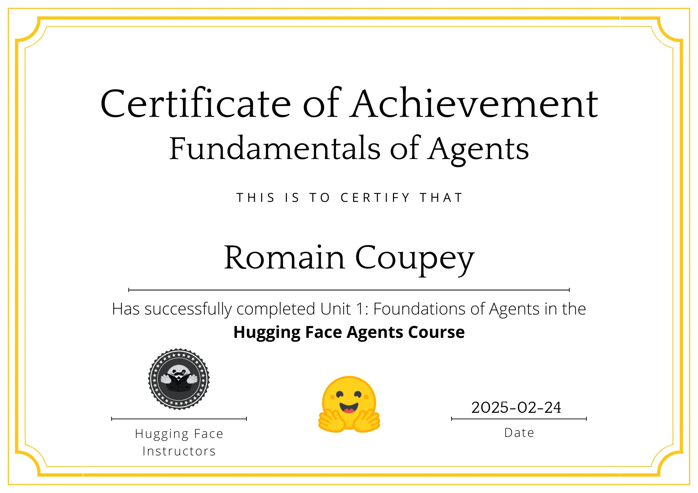

Hugging Face recently released the first unit of their AI Agents course. I wanted to share some takeaways about how AI agents function.

## What is an AI Agent?

An AI Agent is essentially a system that combines an AI model (typically an LLM) with the ability to interact with its environment. Think of it like a digital assistant that can:

- Understand natural language requests
- Plan and reason about how to fulfill those requests
- Take actions using tools to accomplish tasks
- Learn from the results of those actions

## The Three Core Components

The course introduced three fundamental components that make up an agent's workflow:

1. **Thoughts**: The agent's internal reasoning process where it:

   - Analyzes the current situation
   - Plans the next steps
   - Decides which actions to take
   - Uses the ReAct approach (Reasoning + Acting) for step-by-step planning

2. **Actions**: How the agent interacts with its environment through:

   - Tools (functions or APIs it can call)
   - Structured formats (usually JSON or code)
   - The "stop and parse" approach for reliable execution

3. **Observations**: How the agent processes feedback by:
   - Collecting results from actions
   - Updating its understanding
   - Adapting its strategy based on outcomes

## The Role of LLMs

Large Language Models serve as the "brain" of AI agents:

- LLMs work by predicting the next token in a sequence
- They use special tokens to structure their input and output
- Messages are formatted using chat templates specific to each model
- The system prompt defines the agent's behavior and available tools

## Practical Implementation

Key insights of building a simple agent using `smolagents`:

- How to define tools using Python decorators
- The importance of well-structured documentation for tools
- How to use the system prompt to give an agent access to tools
- The iterative nature of the agent's decision-making process

## Real-World Applications

The course demonstrated several practical applications:

- Personal virtual assistants
- Customer service chatbots
- AI NPCs in video games
- Task automation systems

## Conclusion

This new Hugging Face course demystifies AI agents. Rather than being magical black boxes, they're structured systems that combine:

- LLMs for reasoning
- Tools for taking action
- A clear workflow for processing and responding

If you're interested in AI agents, I highly recommend checking out [the course](https://hf.co/learn/agents-course) yourself, or even the [source code](https://github.com/huggingface/agents-course) on GitHub.
