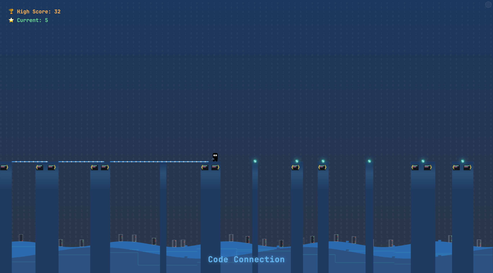

Have you ever found yourself staring at your code editor, thinking about the invisible bridges you're building between functions, modules, and systems? That moment of reflection sparked an idea that would grow into a game: what if those conceptual bridges became literal ones in a simple gameplay experience?



## The Spark of Inspiration

I discovered an interesting "Stick Hero" style game on CodePen created by Hunor Márton Borbély ([@HunorMarton](https://codepen.io/HunorMarton/pen/xxOMQKg)). The elegant simplicity of his codebase and the gameplay immediately captivated me - tap to extend a stick, release to set it in place, and try to reach the next platform. Hunor even created a [YouTube tutorial](https://youtu.be/eue3UdFvwPo) explaining how he built the original game.

<div style="position: relative; padding-bottom: 56.25%; height: 0; overflow: hidden; max-width: 100%; border-radius: 8px;">
  <iframe     style="position: absolute; top: 0; left: 0; width: 100%; height: 100%;"
 src="https://www.youtube.com/embed/eue3UdFvwPo" title="YouTube video player" frameborder="0" allow="accelerometer; autoplay; clipboard-write; encrypted-media; gyroscope; picture-in-picture" allowfullscreen></iframe>
</div>

While playing with Hunor's code, ideas clicked: what if I reimagined this game with a developer theme?

What if the platforms were code blocks? What if the bridges were connections between systems? What if the character was a developer trying to navigate this abstract landscape? What kind of basic animations could I add to make it more engaging?

## Transforming Metaphors into Mechanics

The transformation from concept to playable prototype happened organically:

1. **Code Blocks as Islands**: Each platform became a snippet of code, complete with syntax highlighting and brackets
2. **Connections as Bridges**: The extendable stick became a visual "connection" that grows as you hold down your input
3. **The Developer Avatar**: Our protagonist - a developer with a trusty laptop

The core gameplay emerged naturally from this metaphor: tap to start building a connection, release to set it in place. If your connection reaches the next code block, you can cross safely. Too short or too long, and you'll plummet into the void (something all too familiar when connections between systems fail).

## Technical Challenges and Solutions

Building Code Connection presented several interesting technical hurdles:

### Code Architecture

I implemented a modular architecture with clear separation of concerns across multiple files:

```
.
├── assets
│   ├── code-connection.png    # Game preview image
│   └── favicon.ico            # Game favicon
├── css
│   └── style.css              # Main CSS file
├── js
│   ├── character-reference.js # Character animation and rendering
│   ├── debug.js               # Debug mode and developer tools
│   ├── game-engine.js         # Core game loop and state management
│   ├── game-objects.js        # Game object definitions (Platform, Stick, Server)
│   ├── input-handler.js       # Touch and keyboard input management
│   ├── main.js                # Entry point, bootstraps the game
│   ├── renderer.js            # Handles all canvas drawing operations
│   └── utils.js               # Shared utilities and constants
├── index.html                 # Main game page
├── character-showcase.html    # Character showcase tool
└── README.md                  # Project overview
```

This modular approach made the codebase more maintainable and allowed me to focus on one aspect at a time.

The main game engine coordinates all the components:

```javascript
export class GameEngine {
  constructor() {
    // Get DOM elements
    this.canvas = document.getElementById("game");
    this.ctx = this.canvas.getContext("2d");

    // Initialize game state with basic properties
    this.initializeGameStateBasics();

    // Create renderer first
    this.renderer = new Renderer(this.ctx, this);

    // Now complete the game state initialization
    this.completeGameStateInitialization();

    // Create debug manager
    this.debugManager = new DebugManager(this);

    // Create input handler
    this.inputHandler = new InputHandler(this);

    // Start the game loop
    window.requestAnimationFrame(timestamp => this.animate(timestamp));
  }

  // Game loop
  animate(timestamp) {
    // Calculate elapsed time
    if (!this.lastTimestamp) {
      this.lastTimestamp = timestamp;
    }
    const deltaTime = timestamp - this.lastTimestamp;
    this.lastTimestamp = timestamp;

    // Update game state based on current phase
    this.update(deltaTime);

    // Render the updated state
    this.renderer.render();

    // Continue the animation loop
    window.requestAnimationFrame(timestamp => this.animate(timestamp));
  }
}
```

The game objects are organized into their own classes with clear responsibilities:

```javascript
// Platform class
export class Platform {
  constructor(x, w, id) {
    this.x = x;
    this.w = w;
    this.id = id;
  }
}

// Stick class
export class Stick {
  constructor(x, length = 0, rotation = 0) {
    this.x = x;
    this.length = length;
    this.rotation = rotation;
  }
}

// Server class (background decoration)
export class Server {
  constructor(x) {
    this.x = x;
    // Random server color from a palette
    const serverColors = ["#4A5568", "#2D3748", "#1A202C"];
    this.color = serverColors[Math.floor(Math.random() * serverColors.length)];

    // Pre-generate indicator lights for visual interest
    this.indicatorLights = [];
    const rackLines = 5;
    for (let j = 0; j < rackLines; j++) {
      if (Math.random() > 0.5) {
        const lightColor = Math.random() > 0.5 ? "#68D391" : "#F56565";
        this.indicatorLights.push({ rack: j, color: lightColor });
      }
    }
  }
}
```

### Character Animation State Machine

The character animations presented a first challenge. With five distinct states (waiting, coding, deploying, running, and crashing), I needed a clean way to manage transitions. I created a dedicated character reference module:

```javascript
// Game status constants for the game phase
const gameStatus = {
  waiting: "waiting",
  coding: "coding", // was stretching
  deploying: "deploying", // was turning
  running: "running", // was walking
  migrating: "migrating", // was transitioning
  crashing: "crashing", // was falling
};

/**
 * Main character drawing function
 */
function drawCharacter(ctx, phase, heroX, heroY, canvasHeight, platformHeight) {
  ctx.save();
  ctx.translate(
    heroX - heroWidth / 2,
    heroY + canvasHeight - platformHeight - heroHeight / 2
  );

  // Update blink animation if in waiting phase
  if (phase === "waiting") {
    // Check for blink timing
    if (forceBlinkCheck) {
      const now = Date.now();
      if (now - lastBlinkTime > timeBetweenBlinks) {
        blinkState = "closing";
        blinkTimer = 0;
        consecutiveBlinkCount = 1;
        lastBlinkTime = now;
      }
    }

    // Always update blink state when in waiting phase
    updateBlinkState();
  } else {
    // Reset blink state when not in waiting phase
    blinkState = "open";
  }

  // Draw the base character (common to all states)
  drawCharacterBase(ctx, phase !== "running", phase);

  // Draw state-specific elements
  switch (phase) {
    case "waiting":
      drawWaitingState(ctx);
      break;
    case "coding":
      drawCodingState(ctx, true); // true for animated code
      break;
    case "deploying":
      drawCodingState(ctx, false); // false for static code
      break;
    case "running":
    case "migrating":
      drawRunningState(ctx);
      break;
    case "crashing":
      drawCrashingState(ctx);
      break;
  }

  ctx.restore();
}
```

I even implemented a blinking animation system to make the character feel more alive. The blinking logic creates a natural, lifelike effect by:

1. Gradually closing the eyes by squishing the height while slightly widening them
2. Keeping eyes closed briefly
3. Gradually opening the eyes to return to normal
4. Occasionally triggering multiple consecutive blinks (as humans often do)

This modular approach made animations predictable and maintainable, while allowing for smooth transitions between states.

## The Developer's Aesthetic

For the visual design, I wanted to create something that would resonate with developers. The aesthetic draws from our daily environment:

- **Dark Mode Background**: A tribute to the preferred IDE theme of most developers
- **Monospace Typography**: Using monospace fonts that we stare at all day
- **Syntax Highlighting Colors**: UI elements colored with the familiar palette from code editors
- **Binary and Circuit Patterns**: Subtle background elements that evoke the digital world
- **Server Racks**: Background elements with indicator lights to create a data center feel

The color scheme was particularly important - I wanted it to feel like a comfortable coding environment:

```css
html,
body {
  background-color: #1a202c; /* Dark background like code editor */
  color: #e2e8f0; /* Light text color */
  font-family: "JetBrains Mono", "Fira Code", Consolas, monospace;
}
```

## The Debug Mode Easter Egg

As a nod to our profession, I couldn't resist adding a "debug mode" that can be activated with a special gesture (triple-tap in the top-right corner of the screen).

When activated, this mode reveals:

- State information
- Stick length
- Distance measurements
- Perfect landing zone
- Number of platforms, sticks, servers, and total objects

What started as a development tool became a fun easter egg that adds another layer of developer-themed interaction.

## Character Showcase

An other tool built was an [interactive character showcase page](https://ngopimas.github.io/code-connection/character-showcase.html). Initially created as a way to debug and fine-tune animations, it evolved into a comprehensive visualization tool that helped ensure consistency across all character states.

The showcase features:

- Interactive previews of all animation states (waiting, coding, deploying, running, crashing)
- Controls to adjust scale, animation speed, and grid overlay and background color
- Mini previews of each animation state running in a loop

<iframe src="https://ngopimas.github.io/code-connection/character-showcase.html" style="width: 100%; height: 800px; border: none;"></iframe>

This tool proved invaluable for several reasons:

1. **Animation Debugging**: I could isolate and debug each animation state more easily
2. **Visual Consistency**: Seeing all states side-by-side helped ensure visual coherence
3. **Documentation**: The showcase serves as living documentation of the character's behavior

Creating dedicated showcase pages for key game elements is something I'll definitely do in future projects. The time invested in building these tools paid off.

## Takeaways from Building this Game

### 1. Prototype Early, Refine Later

My first playable version took just one evening to build - it was ugly and buggy, but it proved the concept was fun. This early validation kept me motivated through the more challenging aspects of development.

### 2. User Testing Reveals the Unexpected

When I first shared the game with friends, I was surprised by how they interacted with it:

- Some tried to swipe instead of tap-and-hold
- Others expected the character to jump when tapping
- Many found the initial difficulty curve too steep

These observations led to significant improvements in the control scheme and difficulty progression.

### 3. Small Details Create Delight

The most commented-on features weren't the core mechanics, but the small details:

- The character's blinking animation
- The "clean code" celebration when hitting the perfect spot
- The subtle binary background and the server rack designs
- The typing animation during the "coding" state

These seemingly minor touches created a sense of polish that elevated the entire experience.

## What's Next for Code Connection

While the current version of Code Connection is complete and playable, we could add some features for future enhancements:

- **Language-Themed Levels**: Different worlds based on programming languages, each with unique visual styles and mechanics
- **Achievements**: Challenges like "Build 10 perfect connections in a row" or "Reach a score of 50"
- **Sound Design**: Ambient coding sounds, keyboard clicks, and satisfying connection sounds
- **More Visual Feedback**: Additional animations and effects

## Try It Yourself!

Code Connection is [free to play](https://ngopimas.github.io/code-connection/) in your browser. Whether you're a developer looking for a fun distraction or just someone curious, I hope you enjoy this playful take on our daily work.

The source code is also available on [GitHub](https://github.com/Ngopimas/code-connection) for those interested in how it works or who want to contribute improvements.

## Acknowledgments

I want to express my sincere gratitude to Hunor Márton Borbélyfor creating an open source "Stick Hero" game that served as the foundation for Code Connection. His elegant implementation and clear code structure made it possible for me to build upon his work and create something new. I highly recommend checking out his [original CodePen](https://codepen.io/HunorMarton/pen/xxOMQKg) and [YouTube tutorial](https://youtu.be/eue3UdFvwPo) to see where this journey began.

Building upon the work of others is a fundamental aspect of software development, and this project is a testament to how inspiration and collaboration (even indirectly) can lead to new and exciting creations.
