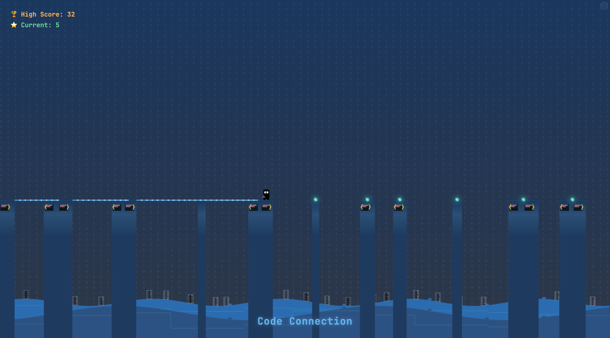

I found a neat Stick Hero clone on CodePen by Hunor Márton Borbély and spent a weekend turning it into something with a developer theme. The original is elegant: tap to extend a stick, release to drop it, try to bridge the gap to the next platform. Hunor even made a [YouTube tutorial](https://youtu.be/eue3UdFvwPo) walking through the build.



<div style="position: relative; padding-bottom: 56.25%; height: 0; overflow: hidden; max-width: 100%; border-radius: 8px;">
 <iframe style="position: absolute; top: 0; left: 0; width: 100%; height: 100%;"
 src="https://www.youtube.com/embed/eue3UdFvwPo" title="YouTube video player" frameborder="0" allow="accelerometer; autoplay; clipboard-write; encrypted-media; gyroscope; picture-in-picture" allowfullscreen></iframe>
</div>

The metaphor came together pretty quickly. Platforms became little code snippets with syntax highlighting. The stick turned into a connection line that grows while you hold the spacebar. The avatar is a dev with a laptop, naturally. Tap to start building, release to set it. Reach the next block and you cross safely. Miss, and you fall into the void - something we all know too well when an API integration goes wrong.

I split the code into small modules so I wouldn't lose my mind in a single 800-line file. There's a game engine, a renderer, input handling, and game objects. The engine bootstraps everything and runs the loop:

```javascript
export class GameEngine {
 constructor() {
 this.canvas = document.getElementById("game");
 this.ctx = this.canvas.getContext("2d");
 this.initializeGameStateBasics();
 this.renderer = new Renderer(this.ctx, this);
 this.completeGameStateInitialization();
 this.debugManager = new DebugManager(this);
 this.inputHandler = new InputHandler(this);
 window.requestAnimationFrame((timestamp) => this.animate(timestamp));
 }

 animate(timestamp) {
 if (!this.lastTimestamp) this.lastTimestamp = timestamp;
 const deltaTime = timestamp - this.lastTimestamp;
 this.lastTimestamp = timestamp;
 this.update(deltaTime);
 this.renderer.render();
 window.requestAnimationFrame((timestamp) => this.animate(timestamp));
 }
}
```

Game objects are plain classes - nothing fancy:

```javascript
export class Platform {
 constructor(x, w, id) {
 this.x = x;
 this.w = w;
 this.id = id;
 }
}

export class Stick {
 constructor(x, length = 0, rotation = 0) {
 this.x = x;
 this.length = length;
 this.rotation = rotation;
 }
}

export class Server {
 constructor(x) {
 this.x = x;
 const serverColors = ["#4A5568", "#2D3748", "#1A202C"];
 this.color = serverColors[Math.floor(Math.random() * serverColors.length)];
 this.indicatorLights = [];
 const rackLines = 5;
 for (let j = 0; j < rackLines; j++) {
 if (Math.random() > 0.5) {
 const lightColor = Math.random() > 0.5 ? "#68D391" : "#F56565";
 this.indicatorLights.push({ rack: j, color: lightColor });
 }
 }
 }
}
```

The character animation was the first real headache. Five states - waiting, coding, deploying, running, crashing - and they all needed to transition smoothly. I ended up with a reference module that draws the base character, then layers on state-specific stuff:

```javascript
const gameStatus = {
 waiting: "waiting",
 coding: "coding",
 deploying: "deploying",
 running: "running",
 migrating: "migrating",
 crashing: "crashing",
};

function drawCharacter(ctx, phase, heroX, heroY, canvasHeight, platformHeight) {
 ctx.save();
 ctx.translate(
 heroX - heroWidth / 2,
 heroY + canvasHeight - platformHeight - heroHeight / 2
 );

 if (phase === "waiting") {
 if (forceBlinkCheck) {
 const now = Date.now();
 if (now - lastBlinkTime > timeBetweenBlinks) {
 blinkState = "closing";
 blinkTimer = 0;
 consecutiveBlinkCount = 1;
 lastBlinkTime = now;
 }
 }
 updateBlinkState();
 } else {
 blinkState = "open";
 }

 drawCharacterBase(ctx, phase !== "running", phase);

 switch (phase) {
 case "waiting":
 drawWaitingState(ctx);
 break;
 case "coding":
 drawCodingState(ctx, true);
 break;
 case "deploying":
 drawCodingState(ctx, false);
 break;
 case "running":
 case "migrating":
 drawRunningState(ctx);
 break;
 case "crashing":
 drawCrashingState(ctx);
 break;
 }

 ctx.restore();
}
```

I even added a blinking animation because static characters look dead. The eyes close gradually, stay shut for a beat, then open again. Occasionally it blinks twice in a row, because humans do that.

Visually I leaned hard into the dark-mode aesthetic. If I'm going to stare at this for hours while debugging, it might as well look like my IDE.

```css
html,
body {
 background-color: #1a202c;
 color: #e2e8f0;
 font-family: "JetBrains Mono", "Fira Code", Consolas, monospace;
}
```

There's a debug mode easter egg, too. Triple-tap the top-right corner and you get state info, stick lengths, perfect landing zones, object counts - the usual dev tools. It started as something I needed to tune the physics, but it's fun to leave in.

I also built a character showcase page to debug animations in isolation. You can cycle through every state, tweak scale and speed, and see mini previews side by side. That page alone saved me hours of console-logging coordinates. I'll definitely build showcase tools like this again for future projects.

The first playable version took one evening. It was ugly and the collision detection was broken, but it proved the idea was fun. That early win kept me going through the polish phase. When I showed it to friends, I learned some unexpected things: people tried to swipe instead of tap-and-hold, some expected the character to jump, and almost everyone found the initial difficulty too punishing. I smoothed out the curve and added a gentler first few platforms.

The details people actually commented on were the small stuff. The blinking. The "clean code" celebration when you nail a perfect landing. The server racks blinking in the background. The typing animation during the "coding" state. Core mechanics get you to a playable game; tiny flourishes make it feel finished.

I have a short list of things I'd maybe add someday - language-themed levels, achievements, sound design - but the current version feels complete. It's [free to play](https://ngopimas.github.io/code-connection/) if you want to kill a few minutes, and the source is on [GitHub](https://github.com/Ngopimas/code-connection).

Massive credit to Hunor Márton Borbély for open-sourcing the original Stick Hero implementation. His clean structure made it possible for me to hack on this without starting from scratch. Building on other people's work is the best part of this job.
