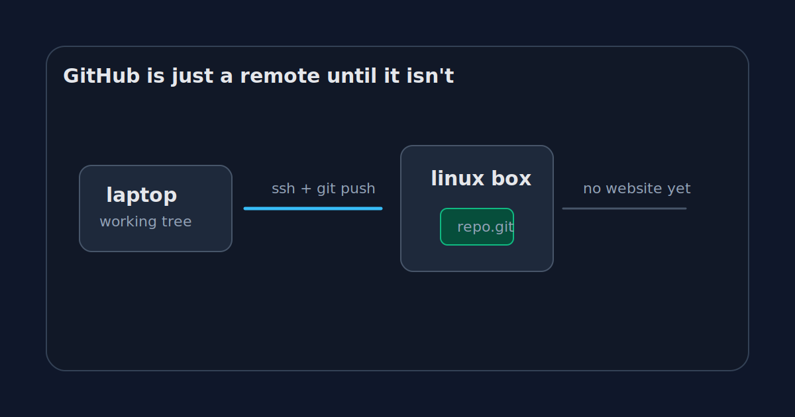

Most developers learn Git and GitHub at the same time, which is convenient and a little damaging.

You clone from GitHub. You push to GitHub. You open pull requests on GitHub. After a while, the words start to blur. Git becomes the thing with the green button, the branch selector, the review comments, the checks, the scary red merge conflict banner.

That is not Git.

Git is much smaller and much stranger. GitHub is a product wrapped around it.

I wanted a clean way to feel that boundary again, so I tried the dumbest version possible: no web UI, no issues, no pull requests, no organizations, no Actions. Just a Linux machine reachable over SSH and a bare repository sitting on disk.

It is not a useful replacement for GitHub. That is not the point.

The point is that it explains the first layer.



## A remote is not a website

A Git remote is basically a named place where Git can exchange objects and refs.

That place can be GitHub. It can be GitLab. It can be a folder on another machine. It can even be another folder on your own laptop, although that is less dramatic.

When you run this:

```bash
git remote add origin git@github.com:romain/project.git
git push origin main
```

the important part is not the browser. The important part is that `origin` resolves to another Git repository that can receive your branch.

So if we remove GitHub, we need somewhere else for that repository to live.

A small Linux box is enough.

```bash
ssh git@example.com
mkdir -p /srv/git/demo.git
cd /srv/git/demo.git
git init --bare
```

The `--bare` flag matters. A normal Git repository has your project files plus a `.git` directory. A bare repository has only the Git database and refs. It does not have a checked-out working tree.

That sounds like a detail until you think about a shared remote.

If several people push to the same machine, which version of the files should be checked out in the working tree? What happens if someone edits files directly on the server? What branch should the server be "on"?

A remote repository should not be editing the project. It should store the history and branch pointers. That is what a bare repo is for.

## The first push

From my laptop, the setup is almost boring:

```bash
git init demo
cd demo
printf "hello\n" > README.md
git add README.md
git commit -m "Initial commit"
git remote add origin git@example.com:/srv/git/demo.git
git push origin main
```

At this point, nothing magical happened.

The server did not render a project page. It did not show a commit graph. It did not create a nice profile card. It just received Git objects and updated a ref called `main`.

That is already enough to collaborate.

Someone else can run:

```bash
git clone git@example.com:/srv/git/demo.git
```

They get the repository. They can commit. They can push. If we both push incompatible histories, Git will complain in the same annoying way it does with GitHub.

We have recreated the oldest and most boring part of GitHub: shared Git hosting.

Boring is not an insult here. Boring infrastructure is often the part you actually rely on.

## Identity appears before product

Even in this tiny version, identity shows up quickly.

If everyone connects as the same Unix user, the server can tell that someone pushed, but not really who. The SSH key may identify the person at the SSH layer, but the filesystem sees the same account.

That is fine for a toy repo. It is not fine for a company.

GitHub's login model, SSH keys, deploy keys, organizations, teams, repository permissions, audit logs, and branch rules are all product layers over this basic need: the remote must know who is asking to change history, and whether they are allowed to do it.

The tiny server makes that feel less abstract.

A remote is not just storage. It is a place where trust decisions eventually accumulate.

## What this version can do

This small setup can already handle the basic Git loop:

```bash
git clone git@example.com:/srv/git/demo.git
# edit files
git add .
git commit -m "Change something"
git push origin main
```

It can also handle branches:

```bash
git checkout -b feature/readme
git push origin feature/readme
```

And it can reject non-fast-forward updates if the remote cannot safely move the branch pointer:

```bash
! [rejected] main -> main (fetch first)
```

That error is not a GitHub personality trait. It is Git protecting the remote ref from being moved in a way that would drop commits from the visible branch history.

GitHub makes the message nicer. The underlying idea is older.

## What this version cannot do

It cannot show you a pull request.

It cannot store review comments.

It cannot run CI and put a green check next to a commit.

It cannot tell you that a dependency has a CVE. It cannot render Markdown beautifully. It cannot notify your team in Slack. It cannot search every repository in an organization. It cannot tell you who approved a production change three months ago.

Those things are not Git.

They are the reason GitHub is valuable.

That distinction is the whole experiment. If you strip GitHub down to SSH and a bare repository, the Git part is still alive. The collaboration product is gone.

## The useful mental model

I now think of GitHub in layers.

At the bottom, there is Git storage: objects, refs, packfiles, branches.

Above that, there is access: SSH keys, users, permissions.

Above that, there is policy: who can push, what can be merged, which checks must pass.

Above that, there is collaboration: pull requests, comments, review state, notifications.

Above that, there is product: search, releases, projects, security alerts, APIs, UI.

You do not need to rebuild all of that to understand the first layer. You only need a bare repository and one successful push.

That is enough to make GitHub feel less magical.

It also makes the next question more interesting.

If `git push` is not uploading a folder to a website, what is it actually doing?

[Next: `git push` does not upload your project](/posts/git-push-does-not-upload-your-project/)
