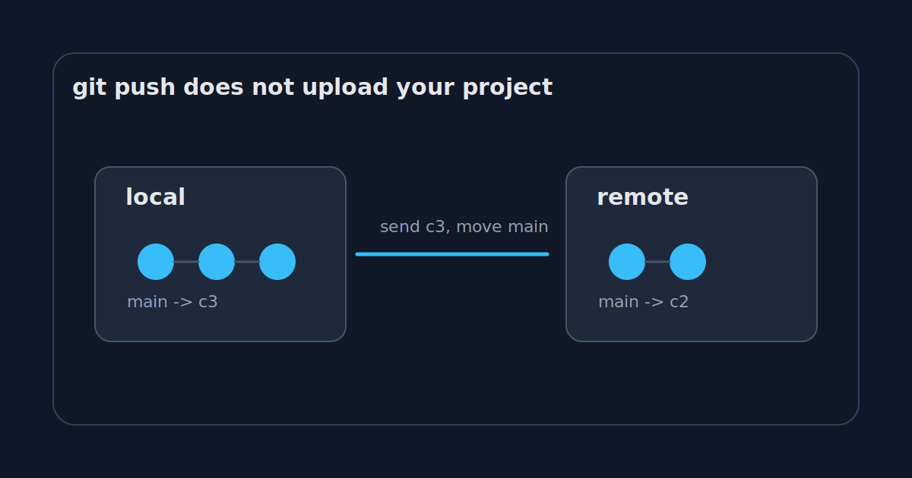

_Part 2 of 5 in [GitHub without the website](/posts/github-is-just-a-remote-until-it-isnt/): rebuilding just enough of GitHub to see where Git stops and the product begins._

The first misleading thing about `git push` is the verb.

"Push" sounds like uploading your project to a server. That is close enough for daily work, but it hides the part that explains most Git errors.

The important part is not the upload. The important part is the negotiation.

Git does not think in project folders. Git thinks in objects and references.

When you push, Git sends the objects the remote is missing, then asks the remote to move a ref. Usually that ref is a branch name like `main`.

That is the whole operation in one sentence. It is also why Git can be both elegant and incredibly rude.



## The files are not the unit

Imagine a tiny repository with one file:

```bash
printf "hello\n" > README.md
git add README.md
git commit -m "Initial commit"
```

Git does not store "the project" as a zip file. It stores content-addressed objects.

A simplified version looks like this:

```text
commit c1
  tree t1
    README.md -> blob b1
```

The blob contains the file content. The tree says which filenames point to which blobs. The commit points to a tree and records metadata: author, message, parent commits.

Change the file and commit again:

```bash
printf "hello again\n" > README.md
git add README.md
git commit -m "Update readme"
```

Now the second commit points to a new tree and has the first commit as its parent.

```text
commit c2
  parent c1
  tree t2
    README.md -> blob b2
```

This is the part worth keeping in your head: a branch is not a folder. A branch is a name pointing at a commit.

`main` might point at `c2`.

```text
main -> c2
```

The commit points backward through history. The branch name points at the tip.

## The remote also has refs

Our tiny GitHub from the previous article is just a bare repository on a server.

It also has objects. It also has refs.

Before your push, the remote might only know about `c1`:

```text
remote main -> c1
```

Your laptop knows about `c2`:

```text
local main -> c2
```

When you run:

```bash
git push origin main
```

Git figures out that the remote is missing `c2` and any objects needed by `c2`. Then it sends those objects. Then it asks the remote to update its `main` ref from `c1` to `c2`.

If `c2` descends from `c1`, the remote can move the pointer forward safely.

That is a fast-forward push.

```text
before: main -> c1
after:  main -> c2
```

No drama. No conflict. The remote moves the label.

## Why pushes get rejected

Now imagine someone else pushed first.

Your laptop thinks the world looks like this:

```text
c1 -> c2
main -> c2
```

The remote has moved on:

```text
c1 -> c3
main -> c3
```

Your `c2` and their `c3` are siblings. Neither contains the other.

If the remote accepted your push and moved `main` from `c3` to `c2`, commit `c3` would disappear from the branch history. It would still exist as an object for a while, but the branch would no longer point to it.

So Git says no.

```text
! [rejected] main -> main (fetch first)
```

That message is annoying because it shows up when you just wanted to go home. But it is doing the right thing.

The server is saying: "I cannot move this branch pointer to your commit without losing the commit I already have. Fetch first, reconcile history, then ask again."

That is much clearer than "GitHub rejected my code."

GitHub is not judging your code here. The ref update is not safe.

## Force push is a pointer rewrite

`git push --force` sounds violent because it is.

It tells the remote to move the branch ref even if the move is not a fast-forward.

```bash
git push --force origin main
```

That does not delete every old object immediately. Git is more boring than that. But it does change what the branch name means.

Before:

```text
main -> c3
```

After:

```text
main -> c2
```

Anyone who pulled `c3` now has a history that disagrees with the server. Anyone who based work on `c3` has a mess to untangle.

This is why force pushing to a shared branch feels dangerous. It is not because GitHub has a moral opinion about `--force`. It is because a branch is a shared pointer, and you just moved it somewhere unexpected.

`--force-with-lease` is a better habit because it adds one important check: "only force push if the remote is still where I think it is."

```bash
git push --force-with-lease origin main
```

That small lease protects you from overwriting someone else's new work by accident.

## GitHub's UI is mostly explaining refs

A surprising amount of GitHub's interface is just a friendly wrapper around this model.

The branch selector shows refs.

The commit page shows objects.

The compare view shows two commit tips and the diff between their reachable trees.

The "This branch is X commits ahead" message is graph math.

The merge button tries to create a new commit or fast-forward a ref, depending on the merge method.

The scary red warning on a protected branch is policy around a ref update.

Once you see branches as movable names, the UI becomes less mysterious.

## The tiny remote can already say no

Our SSH bare repo has no web UI, but it already has the core mechanics.

If two people push incompatible updates to the same branch, the second push is rejected. If someone force pushes, the branch pointer moves. If someone creates a new branch, the server stores another ref.

You can inspect the bare repo directly:

```bash
ssh git@example.com
cd /srv/git/demo.git
git show-ref
```

You might see:

```text
f3a1... refs/heads/main
9b27... refs/heads/feature/readme
```

That is the remote's view of the world.

Not files. Not folders. Refs pointing at commits.

## The part GitHub adds next

So far, the remote is mostly passive. It receives objects, checks whether the ref update is safe, and stores the result.

But a remote can do more than accept storage operations.

It can run code before accepting a push. It can reject direct pushes to `main`. It can require commit messages to match a pattern. It can block large files. It can trigger CI.

The moment the server gets to make policy decisions, the tiny GitHub stops being a passive remote and starts to look like a platform.

[Previous: GitHub is just a remote until it isn't](/posts/github-is-just-a-remote-until-it-isnt/)  
[Next: The server gets a vote](/posts/the-server-gets-a-vote/)
