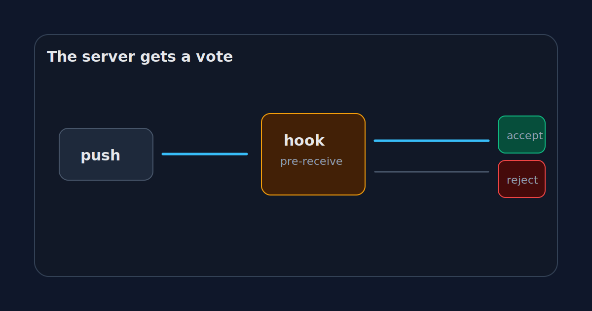

_Part 3 of 5 in [GitHub without the website](/posts/github-is-just-a-remote-until-it-isnt/): rebuilding just enough of GitHub to see where Git stops and the product begins._

A bare Git repository over SSH is already useful, but it is still a little too trusting.

If you can connect and your push is a valid ref update, the server mostly accepts it. That is fine for a personal repo. It is not enough for a team.

Sooner or later, someone pushes directly to `main`. Someone commits a secret. Someone bypasses tests because the change is "tiny". Someone rewrites history and swears they only touched their own branch.

This is where the remote stops being storage and starts having opinions.

The primitive is old and unglamorous: hooks.



## Hooks are where policy enters

A hook is a script Git runs at a specific point in its workflow.

Client-side hooks run on your machine. They can format code before a commit or block a bad commit message. They are useful, but they are not authority. A developer can skip them, forget to install them, or have a slightly different setup.

Server-side hooks run on the remote.

That matters.

If the server-side hook rejects a push, the branch does not move. The policy is enforced at the point where shared history changes.

In a bare repository, hooks live here:

```text
/srv/git/demo.git/hooks/
```

Git even creates samples:

```text
pre-receive.sample
update.sample
post-receive.sample
```

The names are not decorative.

`pre-receive` runs before refs are updated. It can reject the entire push.

`update` runs once per ref being updated. It can reject one branch update.

`post-receive` runs after refs are updated. It is useful for notifications or deployment triggers, but it is too late to block the push.

## Blocking direct pushes to main

The simplest useful hook is branch protection.

GitHub has a nice UI for this. Our tiny GitHub has a shell script.

```bash
#!/usr/bin/env bash
set -euo pipefail

while read oldrev newrev refname; do
  if [ "$refname" = "refs/heads/main" ]; then
    echo "Direct pushes to main are not allowed."
    echo "Push a branch and merge it after review."
    exit 1
  fi
done
```

Save that as:

```text
/srv/git/demo.git/hooks/pre-receive
```

Then make it executable:

```bash
chmod +x /srv/git/demo.git/hooks/pre-receive
```

Now a direct push to `main` fails.

```text
remote: Direct pushes to main are not allowed.
remote: Push a branch and merge it after review.
! [remote rejected] main -> main (pre-receive hook declined)
```

This is crude, but the idea is not crude at all.

The remote is now an authority. It can say: "Even if this is a valid Git update, I will not accept it."

That sentence is basically the beginning of branch protection.

## Checks before history changes

A hook can inspect the commits being introduced.

For example, reject commits with suspicious messages:

```bash
#!/usr/bin/env bash
set -euo pipefail

while read oldrev newrev refname; do
  for commit in $(git rev-list "$oldrev".."$newrev"); do
    subject=$(git log -1 --pretty=%s "$commit")
    if [[ "$subject" == *"WIP"* ]]; then
      echo "Commit $commit contains WIP in the subject."
      exit 1
    fi
  done
done
```

Or block obvious secrets inside the same loop:

```bash
while read oldrev newrev refname; do
  if git grep -n "AWS_SECRET_ACCESS_KEY" "$newrev"; then
    echo "Possible secret detected."
    exit 1
  fi
done
```

This is not a full security scanner. Please do not build your compliance program out of a blog post shell script.

But it shows the shape of the thing.

GitHub's protected branches, required checks, secret scanning, and rulesets are polished product versions of a simple idea: before the shared ref moves, the server can run policy.

## Why server-side is different

Client-side checks are about convenience.

Server-side checks are about trust.

A formatter hook on my laptop helps me avoid dirty commits. A pre-receive hook on the server protects everyone else from my bad day.

That difference is important in teams. The shared repository is not just a backup location. It is a coordination point. It decides what counts as accepted history.

This is also why "but the tests passed locally" is not enough in serious workflows.

The local machine is not the source of truth. The remote is.

## The hook is also a terrible product

Our hook works, but it is miserable compared to GitHub.

Changing the policy requires SSH access to the server. The error messages are whatever the shell script prints. There is no UI to explain which rule failed. There is no audit trail. There is no per-team permission model. There is no temporary bypass with approval. There is no list of required checks with friendly names.

This is where the product value becomes obvious.

GitHub did not invent the idea that a remote can reject a push. It made that idea usable for normal teams.

A staff engineer can configure a protected branch without editing a shell script in `/srv/git`. A reviewer can see which checks passed. A developer can understand why a merge is blocked without reading Bash.

That is not trivial. It is the boring product work that makes a powerful primitive safe to use at scale.

## Hooks are the bridge to automation

Once the server can run code on push, the next temptation is obvious: run more code.

A `post-receive` hook can deploy a static site:

```bash
#!/usr/bin/env bash
set -euo pipefail

worktree=/var/www/demo
GIT_WORK_TREE="$worktree" git checkout -f main
```

It can send a webhook. It can enqueue a CI job. It can update a mirror. It can notify a chat room.

This is the same slope that leads from Git hosting to a developer platform.

At first, the remote stores code.

Then it validates code.

Then it reacts to code.

After that, staying small is a choice you have to keep making.

## The missing social object

With hooks, our tiny GitHub can block direct pushes to `main`. It can force people to push branches instead.

But what happens after the branch exists?

Git knows how to compare branches. Git knows how to merge. Git knows how to apply patches. It does not know how to host a conversation, request a review, record an approval, or put a big green button in front of a maintainer.

That object is the pull request. It is the place where a branch stops being only a branch and becomes a proposed change.

[Previous: `git push` does not upload your project](/posts/git-push-does-not-upload-your-project/)  
[Next: Pull requests are not Git](/posts/pull-requests-are-not-git/)
