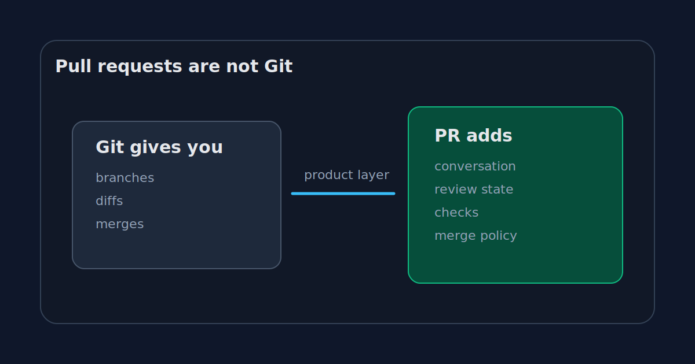

_Part 4 of 5 in [Tiny GitHub from first principles](/posts/github-is-just-a-remote-until-it-isnt/)._

Pull requests feel so normal now that it is easy to forget they are not part of Git.

Git has commits. Git has branches. Git has diffs. Git has merges. Git has patches. Git can send work by email if you want to feel old or work on the Linux kernel.

But Git does not have a pull request object.

There is no `.git/pull-requests/42`. There is no native Git command that stores review comments, approvals, CI status, merge queues, requested changes, or a little avatar next to a nitpick about naming.

A pull request is a product object built around Git data.

That sounds obvious once stated. It also explains a lot about modern development.



## What Git already gives us

Suppose I create a branch:

```bash
git checkout -b feature/tiny-github
# edit files
git commit -am "Explain bare remotes"
git push origin feature/tiny-github
```

Git now has enough information to compare my branch with `main`.

```bash
git diff main...feature/tiny-github
```

It can show commits:

```bash
git log --oneline main..feature/tiny-github
```

It can merge:

```bash
git checkout main
git merge feature/tiny-github
```

It can generate a patch:

```bash
git format-patch main..feature/tiny-github
```

So, strictly speaking, we do not need GitHub to move code from a branch into `main`.

We need GitHub because the hard part is usually not the merge. It is the coordination around the merge.

## The missing thing is conversation

A pull request gives a branch a room.

That room has a title, a description, reviewers, comments, inline discussions, status checks, labels, permissions, timeline events, and a final decision.

The branch is Git.

The room is GitHub.

This is why a pull request can be closed without merging. The branch still exists. The commits still exist. The conversation ended.

It is also why a pull request can be reopened. Git did not resurrect anything special. The product object changed state.

Once you see the PR as a room around a diff, a lot of GitHub behavior makes more sense.

Review comments are not stored in Git. They are attached to GitHub's model of a file diff at a point in time.

Approvals are not Git. They are review records.

Required checks are not Git. They are status records attached to commits.

The merge button is not Git. It is a controlled way to perform a Git operation after product-level rules pass.

## Rebuilding a terrible pull request by hand

Our tiny GitHub can fake a PR workflow, badly.

Developer pushes a branch:

```bash
git push origin feature/tiny-github
```

Reviewer fetches it:

```bash
git fetch origin feature/tiny-github
git diff origin/main...origin/feature/tiny-github
```

Reviewer writes comments in chat, email, or a text file. Developer pushes more commits. Reviewer fetches again. Eventually someone merges:

```bash
git checkout main
git merge --no-ff origin/feature/tiny-github
git push origin main
```

This works.

It is also awful.

There is no durable review history. No inline comments tied to lines. No easy way to see whether the latest push invalidated a previous approval. No checks integrated into the decision. No merge queue. No audit trail that a future teammate can understand in thirty seconds.

The Git operations are fine. The collaboration layer is missing.

## Git email workflows are a useful contrast

Some projects do not use pull requests the GitHub way.

The Linux kernel famously uses patches over email. A contributor sends a patch series. Maintainers review it. The discussion happens on mailing lists. Eventually a maintainer applies the patches.

That workflow is not primitive. It is just different.

It makes one thing clear: Git does not require GitHub's PR model. The branch plus PR workflow is a product choice, not a law of nature.

Most teams still choose it because it fits the way they work. The PR becomes the shared unit of review. It is small enough to discuss, visible enough to track, and structured enough for automation.

## The PR changed how we design work

This is the part I find more interesting than the mechanics.

Once pull requests become the default unit of collaboration, developers start shaping work to fit them.

We split features into reviewable chunks. We write descriptions for changes that already exist. We add screenshots because the PR template asks for them. We wait for CI because the button is disabled. We ask for approval because the branch rule requires it.

Some of that is good.

Small reviewable changes are usually better than giant surprise merges. CI before merge is usually better than CI after production. A written explanation often catches vague thinking.

Some of it is theater.

A PR can be approved without being understood. A green check can test the wrong thing. A large team can drown in review notifications and call it quality control.

The pull request is a tool, not a moral framework.

But it is a powerful tool because it sits exactly where technical change becomes social change.

## Why this matters for GitHub

If GitHub only hosted Git repositories, it would be useful.

Pull requests made it sticky.

They turned GitHub from a place where code lives into a place where code decisions happen. That is a much stronger position.

The tiny SSH remote can store my branch. It cannot tell the story of why the branch should merge.

A pull request can.

It connects the Git primitives to human workflow:

```text
branch -> diff -> discussion -> checks -> approval -> merge
```

Only two parts of that chain are pure Git.

That is the point.

## The merge button is not the center

The merge button gets the attention because it changes the repository. But the value of a PR is often everything before the click.

The discussion that prevents a bad abstraction.

The test failure that catches a broken assumption.

The reviewer who notices the migration path is unsafe.

The short comment that explains why the weird code is intentional.

Those things do not belong in the Git object database. They belong around it.

That is why pull requests are not Git, and why they are still one of the most important parts of GitHub.

[Previous: The server gets a vote](/posts/the-server-gets-a-vote/)  
[Next: What GitHub really sells](/posts/what-github-really-sells/)
