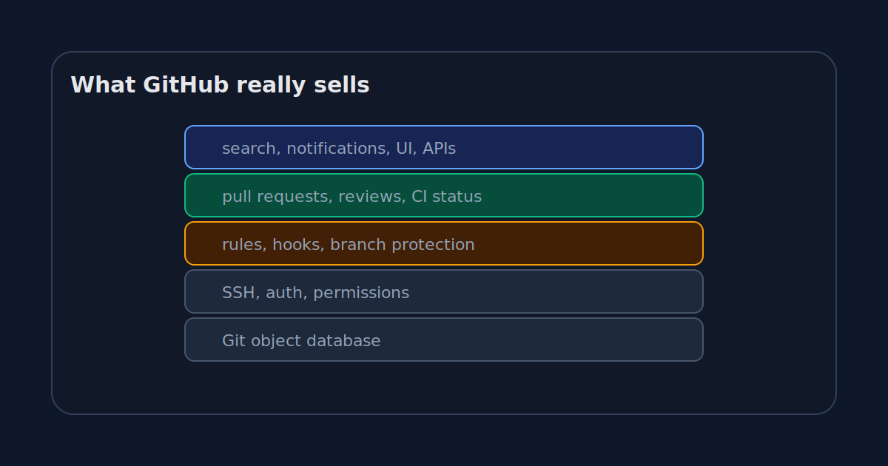

_Part 5 of 5 in [GitHub without the website](/posts/github-is-just-a-remote-until-it-isnt/): rebuilding just enough of GitHub to see where Git stops and the product begins._

The tiny GitHub experiment starts as a joke and ends as a decent product lesson.

Put a bare Git repository on a Linux box. Connect over SSH. Push a branch. Add a hook. Block direct pushes to `main`. Fake a pull request with a diff and a chat thread.

You can get surprisingly far, which is the fun part.

You also hit the wall quickly, which is the useful part.

That wall is where GitHub lives.



## Git hosting is the base layer

At the bottom, GitHub stores Git repositories.

That sounds obvious, but it is worth separating from everything else. The repository is the durable core. Objects, refs, branches, tags. Clone and push. Fetch and merge.

Our Linux box can do this.

It can host a bare repository at:

```text
/srv/git/demo.git
```

It can accept:

```bash
git push origin main
```

It can let someone else clone:

```bash
git clone git@example.com:/srv/git/demo.git
```

This base layer matters. If Git hosting is unreliable, nothing above it matters. But the base layer is not enough to explain GitHub's value anymore.

Lots of products can host Git.

GitHub won the social and workflow layers around it.

## Identity and permissions are product, not decoration

The next layer is identity.

Who are you? Which repositories can you read? Which branches can you push? Which secrets can your workflow access? Which organization owns the code? Which team can approve production changes?

A Unix server can answer some of that with users, groups, SSH keys, and filesystem permissions.

It gets ugly fast.

GitHub turns identity into a product surface. SSH keys are attached to accounts. Accounts belong to organizations. Organizations have teams. Teams have repository roles. Repositories have branch rules. Actions have tokens. Audit logs record who changed what.

None of that is glamorous when it works.

It becomes very glamorous the first time you need to remove a contractor's access from twenty repositories at 18:04 on a Friday.

## Rules are where trust becomes visible

A tiny server-side hook can reject a push.

GitHub turns that into rules people can see and manage:

- require a pull request before merging
- require approvals
- require status checks
- block force pushes
- require signed commits
- restrict who can push matching branches

The important part is not that GitHub can reject things. A Bash script can reject things.

The important part is that GitHub makes the rules understandable, reviewable, and tied to identities.

A failed rule is visible in the UI. A required check has a name. A bypass can be recorded. A branch can be protected without giving everyone shell access to the remote.

That is the product version of "the server gets a vote."

## Pull requests are the center of gravity

If I had to pick the one object that explains GitHub, I would pick the pull request.

Not the repository. Not the issue. Not Actions.

The pull request.

It is where Git data becomes team decision-making. A branch is proposed. A diff is rendered. Tests attach results. People discuss lines. Reviewers approve or block. The merge button becomes available only when the rules say it can.

The PR is not Git, but it is built close enough to Git that it feels native.

That is the trick.

A good developer tool hides product decisions inside workflows that feel technical. After a few years, the product shape feels inevitable. Of course a change should be a branch plus a PR plus checks plus review. What else would it be?

There are other answers. Email patches. Trunk-based development with pairing. Gerrit-style change reviews. Internal monorepo tools. Direct commits with strong ownership.

GitHub did not discover the only possible workflow.

It popularized one that worked well enough for millions of teams.

## Automation made the repository reactive

GitHub Actions changed the repository from a place where code sits into a place where code triggers work.

Push a commit, run tests.

Open a PR, build a preview.

Create a tag, publish a package.

Change infrastructure code, plan a deployment.

Our tiny Git server can fake this with hooks, but it quickly becomes a maintenance problem. Where do logs live? Who can rerun a failed job? Which secrets are available? Can a fork access them? What environment is the job running in? How do you cancel old runs? How do you debug a flaky test?

The shell script was fun. The platform is useful.

That pattern repeats across GitHub. The primitive is often simple. The product work is making it safe, visible, and repeatable.

## The boring features are the expensive ones

Search, notifications, audit logs, repository settings, team management, code owners, release pages, security advisories, Dependabot, APIs, status pages.

None of these make a great conference demo by themselves. Together, they are why organizations stay.

A developer can host a bare repo in five minutes. A company needs a system that answers boring questions every day:

- Who changed this?
- Why was this merged?
- Which check failed?
- Who approved it?
- Which release contains the fix?
- Which repos use the vulnerable package?
- Which token had access?
- Which team owns this service?

Git stores history. GitHub stores a lot of the context around history.

That context is the product.

## The tiny version was still worth building

The SSH experiment is not a recommendation to self-host Git with shell scripts.

I would not run a serious team this way unless I had very specific reasons and a high tolerance for boring operational work.

But rebuilding the small core is useful because it removes the fog.

A remote is not a website.

A push is not a folder upload.

A branch is a ref.

A server can reject an update.

A pull request is not Git.

Once those pieces are clear, GitHub becomes easier to understand and easier to criticize fairly.

Some GitHub features are just polished wrappers around old Git mechanics. Some are genuinely hard product layers. Some are workflow choices that feel natural only because we have repeated them for years.

That is a healthier mental model than treating GitHub as magic or treating Git as the entire story.

Git is the database and protocol at the center. GitHub is the collaboration system around it.

That distinction sounds academic until something breaks: a rejected push, a blocked merge, a missing approval, a failed check that saves you from yourself.

Then the boundary matters.

Git can tell you what history is. GitHub helps a team decide what history should become.

[Previous: Pull requests are not Git](/posts/pull-requests-are-not-git/)
