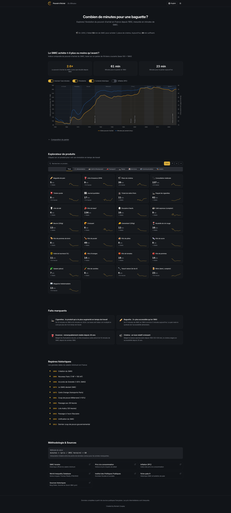

A few years ago, I stumbled upon an article in [Alternatives Économiques](https://www.alternatives-economiques.fr/) that tried to answer a deceptively simple question: did the switch to the euro actually make things more expensive in France? The article used an elegant trick - instead of comparing raw prices (which inflation makes meaningless over time), it measured how many **minutes of minimum wage** you'd need to earn to buy everyday items.

That idea stuck with me. What if you could explore that concept interactively?

This post is about how I built [En Minutes](https://enminutes.fr) - a bilingual, interactive data visualization app that lets you explore the real cost of everyday French goods from the 1950s to today - and how it evolved from a quick prototype into something much more rigorous, with AI as both a development partner and an auditor that caught a fundamental error in my data.

## The Core Idea

The premise is simple: a baguette costs around 1.20€ today. But is that expensive? Compared to what?

Raw prices are deceiving. A baguette cost about 0.067€ (in equivalent francs) in 1960, which sounds absurdly cheap - but the net minimum wage was around 0.22€ per hour. That means earning a baguette took roughly **18 minutes of work**. Today, with a net SMIC of 9.52€/h, it takes about **7 minutes**.

By converting every price into minutes of work at a given salary, you get a universal unit that cuts through inflation, currency changes, and decades of economic shifts. It lets you compare a 1955 pack of cigarettes to a 2024 one in a way that actually means something.

## What It Does

The app tracks **30+ consumer products** — from baguettes and coffee to cinema tickets, electricity, and rent — across seven decades of data. You can browse interactive charts for each product, switch between minimum wage, median salary and mean salary to recalculate everything on the fly, compare two years side by side, or look at the aggregated purchasing power index with overlays for inflation, productivity, and presidential terms. Everything is bilingual and works in dark mode, because I like my charts readable at 11pm.

## The Stack

I went with a modern, static-first approach:

- **Vite + React 18 + TypeScript** - fast dev loop, type safety, zero backend needed
- **shadcn/ui + Radix** - accessible, composable UI components (Select, Dialog, Switch, Tabs)
- **Tailwind CSS v3** - utility-first styling with a custom CSS variable system for theme switching
- **Chart.js + react-chartjs-2 + chartjs-plugin-annotation** - the charting layer, with annotation support for historical events (euro introduction, oil crises, Grenelle accords)
- **Framer Motion** - subtle entrance animations throughout

The whole app is statically built - no server, no API, no database. All the data lives in a single TypeScript file. It deploys to GitHub Pages with a simple workflow.

## Data: The Hard Part

Sourcing 70 years of consumer prices in France is not as straightforward as you'd think. There is no single API that gives you the price of a baguette in 1962.

I ended up combining multiple sources:

- **INSEE** - France's national statistics institute, the gold standard for price indices and SMIC history
- **Sénat reports** - surprisingly detailed historical price surveys
- **BoulangerieNet** - an industry site that tracked baguette prices over decades
- **Thomas Piketty / PSE** - historical economic datasets
- **Historical press** - newspaper archives for items like cinema tickets and stamps

Each product has a data array mapping years to prices - in francs before 2002, in euros after. The app normalizes everything at render time by dividing the price by the per-minute salary rate for that year. No pre-computation, no derived datasets to maintain.

**Tip:** When working with French economic data, always check whether amounts are in "anciens francs" (pre-1960), "nouveaux francs" (1960-2002), or euros. Getting this wrong will silently give you results that are off by a factor of 100.

### The Brut/Net Discovery

The first version of the app used **gross SMIC** rates (SMIC brut). It took an AI-driven audit (more on that below) to surface a problem I should have caught myself: if you're measuring "how many minutes of work to buy X," the denominator should be take-home pay, not gross pay. Nobody buys a baguette with their pre-tax salary.

This sounds like a small distinction, but it changes every number in the app. Social charges in France have grown substantially over the decades - from roughly 6% in the 1950s to over 21% after the introduction of CSG/CRDS in the late 1990s. Using gross rates systematically understated how long it _actually_ took workers to earn everyday goods, especially in earlier decades when the gap between gross and net was smaller and the resulting distortion was more subtle.

The fix wasn't trivial. INSEE publishes monthly net SMIC values from 2005 onward (series [000879878](https://www.insee.fr/fr/statistiques/serie/000879878), converted to hourly by dividing by 151.67h). For 1950-2004, I had to reconstruct net rates by applying historical cotisation rates - social charges that grew from around 6% in the 1950s to about 21% by the late 1990s, tracking the introduction of CSG (1991) and CRDS (1996). This required digging through historical data from fiche-paie.fr and cross-referencing with INSEE publications.

Every price-in-minutes figure in the app changed. The 1960 baguette went from a (wrong) gross-based calculation to approximately 18 minutes at net SMIC - a correction that tells a more honest story about what workers actually experienced.

### New Products, New Challenges

The current version tracks electricity (€/kWh, from 1960), rent (€/m² per month, Paris area, from 1970), and internet subscriptions (from 2000), in addition to the original set. Each came with its own data-sourcing puzzle. The doctor visit price was also updated to reflect the November 2024 increase to 30€.

Rent required a particular design decision: its trajectory is so extreme - Paris rents have exploded relative to wages - that including it in the composite purchasing power index with any meaningful weight would dominate and distort the overall trend. So rent is tracked as its own product with full charts and comparisons, but its weight in the composite basket is set to zero.

## Keeping the Data Fresh

One thing I didn't want was a project that goes stale the moment I stop manually updating it. The repo includes a GitHub Actions workflow that runs every February 1st (INSEE typically publishes full-year data in January). It:

1. Fetches the latest **net SMIC** rates from INSEE (idbank `000879878`)
2. Fetches **mean salary** (idbank `010752366`) and **median salary** (idbank `010752342`) from INSEE DADS
3. Computes new CPI inflation figures from the IPC index
4. For products with direct INSEE price series, fetches the latest retail prices; for others, uses IPC indices calibrated against known anchor prices
5. Only **adds** new years to the dataset - it never modifies historical data
6. Opens a pull request with a full diff for review before anything gets merged

The script now includes retry logic (3 retries with exponential backoff) and data validation with SMIC range sanity checks. If any fetch fails, it skips that source rather than risking partial corruption.

It's an intentionally conservative pipeline. The human still reviews and merges - but the tedious part of pulling numbers from government APIs is automated.

## Beyond Minimum Wage

The original version only measured purchasing power against the SMIC. That's a useful reference, but it tells one story. A minimum-wage worker's experience of price changes is real, but it's not the whole picture.

The current version lets users switch between three salary references:

- **SMIC** (minimum wage) - the baseline, available from 1950
- **Median salary** - from INSEE DADS (series [010752342](https://www.insee.fr/fr/statistiques/serie/010752342)), available from 1996. This is what a "typical" French worker earns.
- **Mean salary** - from INSEE DADS (series [010752366](https://www.insee.fr/fr/statistiques/serie/010752366)). Higher than the median, pulled up by top earners.

When you switch, everything recalculates: charts, comparisons, insights, fun facts, even the hero animation. It's the same data viewed through a different economic lens.

What this reveals is interesting. Some products that got dramatically cheaper relative to the SMIC show a more modest improvement relative to the median salary - because the SMIC has been deliberately boosted by policy (the "coups de pouce") in ways that median wages haven't. Other products tell roughly the same story regardless of reference, suggesting the price change is the dominant factor, not the wage dynamic.

## Productivity: The Divergence

One of the most striking additions is a productivity overlay on the purchasing power index chart. Toggle it on and you see GDP per hour worked in France (sourced from OECD data, base 100), plotted alongside the purchasing power trend.

The data runs from 1960 to the present. The 1995-2024 segment comes from the OECD Productivity Levels dataset; the 1960-1994 segment was back-projected using documented growth rates from France Stratégie (2020) and Cette, Kocoglu & Mairesse (2009).

The picture is stark: productivity in France has grown roughly **4.2 times** since 1960, while SMIC-based purchasing power has only grown about **2.2 times**. French workers produce far more value per hour than they did in 1960, but their ability to buy everyday goods hasn't kept pace.

This is a well-known macro-economic phenomenon - the decoupling of productivity and wages - but seeing it rendered against concrete goods (baguettes, metro tickets, cinema) makes it visceral in a way that abstract GDP charts don't. The productivity index also dynamically rebases when you switch salary references, so you can explore how the gap looks from different positions in the income distribution.

## AI as a Development Partner

This project was built almost entirely through iterative prompting with [Perplexity Computer](https://www.perplexity.ai/computer). Not as a code generator that spits out a scaffold and walks away - as a persistent collaborator across dozens of rounds of refinement.

### The Feedback Loop

The workflow wasn't "prompt, get code, done." It was closer to pair programming where one partner has infinite patience:

1. **Start with intent**: "Build an interactive purchasing power visualizer for France, 30+ items, bilingual, Chart.js"
2. **Review, critique, redirect**: "The comparison format (2.0x -50%) is confusing. Try natural language instead."
3. **Iterate on details**: "Move the year dropdowns above the values, not beside them."
4. **QA together**: The AI ran Playwright tests at each step - desktop, mobile, dark mode, edge cases.

Each round produced a deployable build. The project went through a brutalist redesign, a full shadcn/ui migration, and dozens of UX refinements - all within the same continuous session.

### The Audit

What made the v2 evolution different was using the AI not just for building, but for **auditing**. I asked it to do a full code quality and data accuracy review - methodology correctness, data integrity, feature opportunities.

The AI researched INSEE data series, cross-checked historical cotisation rates, verified price sources, and identified the brut/net SMIC error described above. That single finding - "you're using gross wages when the concept requires net wages" - invalidated every number in the original app. It's the kind of error that's easy to make (many SMIC series on INSEE are gross by default) and hard to catch without someone systematically questioning the methodology.

The audit also surfaced ideas that became real features: the salary reference selector, the productivity overlay, and several new products. It was less "code review" and more "what would a domain expert flag?"

### Where AI Excelled

- **Boilerplate and wiring**: Setting up Vite, Tailwind, Chart.js config, the i18n translation layer, dark mode CSS variables - the stuff that's well-documented but time-consuming. This went from hours to minutes.
- **Variant generation**: "Give me 4 logo options" or "Try 3 different comparison layouts" - exploring the design space quickly.
- **Cross-cutting refactors**: When I decided to swap the entire design to brutalist style, the AI rewrote every component in one pass. When the salary reference feature required threading a new context through every component, same thing.
- **Research and verification**: The AI could look up INSEE series identifiers, cross-reference cotisation rates across decades, and flag inconsistencies - turning what would be a multi-day literature review into an afternoon.
- **Visual QA**: Automated screenshot comparison across breakpoints and themes caught layout issues I would have missed.

### Where I Stayed in the Driver's Seat

- **Data curation**: Deciding which items to include, finding and verifying historical prices, handling edge cases (items that didn't exist in the 1950s, price discontinuities during the franc-to-euro transition).
- **Editorial judgment**: What story does the data tell? Which insights deserve to be highlighted? The AI can compute that cigarettes cost 3x more in minutes of SMIC - but the decision to feature that as a key insight is a human one.
- **Design direction**: I drove the aesthetic decisions - the palette, the brutalist phase, the eventual refinement. The AI executed faithfully, but the taste was mine.
- **Methodology calls**: Excluding rent from the composite index, choosing how to handle the brut/net transition for pre-2005 years, deciding which productivity dataset to trust - these require judgment that the AI can inform but shouldn't make alone.

## What I Learned

### 1. Minutes of Work > Raw Prices

This is the single most important design decision in the project. Showing that a baguette went from 0.24F to 1.10€ tells you nothing. Showing it went from ~18 minutes to ~7 minutes tells a story. The unit of measurement _is_ the narrative.

### 2. Net, Not Gross

If you're going to express economic reality in terms of what workers can actually buy, use take-home pay. Gross wages include money workers never see. This seems obvious in retrospect, but the original version got it wrong - and the error was invisible until someone questioned the methodology from first principles. Always interrogate your denominator.

### 3. One Dataset, Multiple Lenses

Adding the salary reference selector was a relatively modest engineering lift (a new React context, some recalculation logic) but it transformed the app from telling one story to telling three. The same data reveals different truths depending on whose wages you measure against. Design for perspectival flexibility when the data supports it.

### 4. Bilingual Is Not Just Translation

Supporting French and English isn't just about swapping strings. Number formatting differs (virgule vs. period), some concepts don't translate cleanly ("SMIC" needs explanation in English), and cultural context matters - a French user immediately knows what a "timbre" is; an English user might not.

### 5. Static Data, Dynamic Feel

The entire dataset is a TypeScript file. No API calls, no loading states, no backend. Yet the app feels dynamic because all the computations - minute conversions, comparisons, index aggregation, salary reference switching - happen at render time in the browser. This keeps the architecture dead simple while enabling rich interactivity.

### 6. AI Iteration Speed Changes the Process

When each design iteration takes 2 minutes instead of 2 hours, you explore more options. I went through a full brutalist redesign, decided it wasn't right, reverted, and refined - all in a single evening. But the bigger shift in v2 was using the AI for analysis, not just execution. Having it audit the project turned up a fundamental data error and generated a roadmap for meaningful improvements. The AI isn't just faster hands - it's a second perspective.

## TL;DR

Measuring prices in minutes of work cuts through inflation and currency changes. The app tracks 30+ items over 70+ years, using net (not gross) minimum wage as the baseline. Switching between SMIC, median and mean salary reveals different economic stories. The productivity overlay shows French workers produce 4.2x more value per hour than in 1960, but their purchasing power only grew 2.2x. AI helped build and audit the project, but the hard part was sourcing the data — no API has the 1965 croissant price.

## Further Reading

- [En Minutes on GitHub](https://github.com/Ngopimas/enminutes) - full source code, licensed under CC BY 4.0
- [INSEE - SMIC mensuel net de prélèvements](https://www.insee.fr/fr/statistiques/serie/000879878) - Net SMIC monthly series
- [INSEE - SMIC annuel](https://www.insee.fr/fr/statistiques/1375188) - Historical SMIC data
- [INSEE - Salaire net moyen EQTP](https://www.insee.fr/fr/statistiques/serie/010752366) - Mean salary series (DADS)
- [INSEE - Salaire net médian EQTP](https://www.insee.fr/fr/statistiques/serie/010752342) - Median salary series (DADS)
- [OECD Productivity Levels](https://data-explorer.oecd.org/vis?lc=en&df[id]=DSD_PDB%40DF_PDB_LV&dq=FRA.A.GDPHRS..XDC_H.Q) - GDP per hour worked
- [Alternatives Économiques - Pouvoir d'achat](https://www.alternatives-economiques.fr/pouvoir-dachat-1802202197694.html) - Economic context and definitions
- [Europe1 - Le prix d'une baguette en minutes de travail](https://www.europe1.fr/economie/Le-prix-d-une-baguette-c-est-desormais-14-minutes-de-travail-763946) - UFC-Que Choisir's similar approach using average salary
- [Mouvement Européen - L'euro et les prix](https://mouvement-europeen.eu/uedecryptee-est-ce-que-leuro-a-fait-exploser-les-prix-a-la-consommation/) - Debunking the "euro inflation" myth
