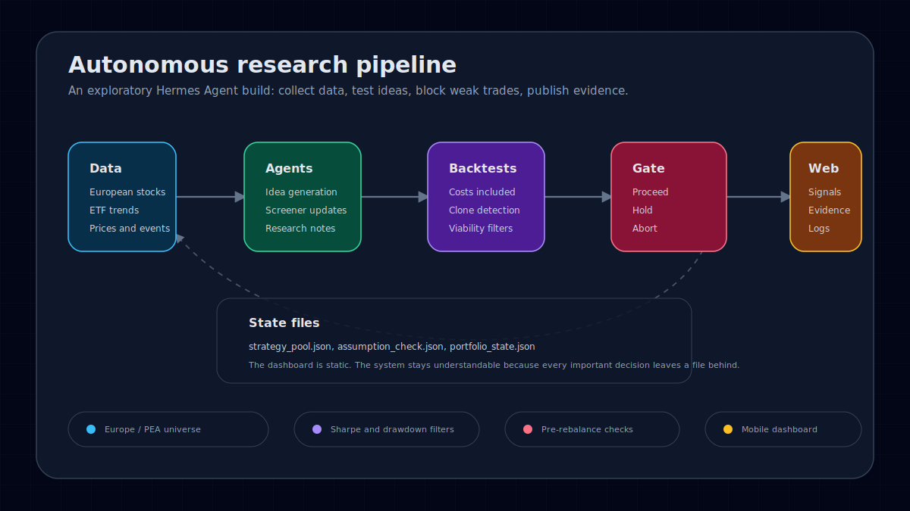
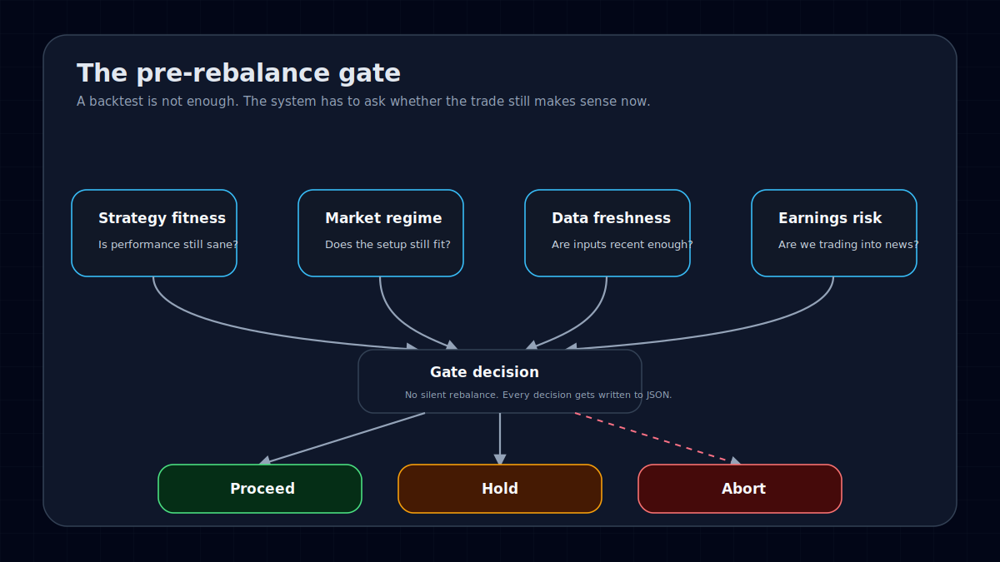
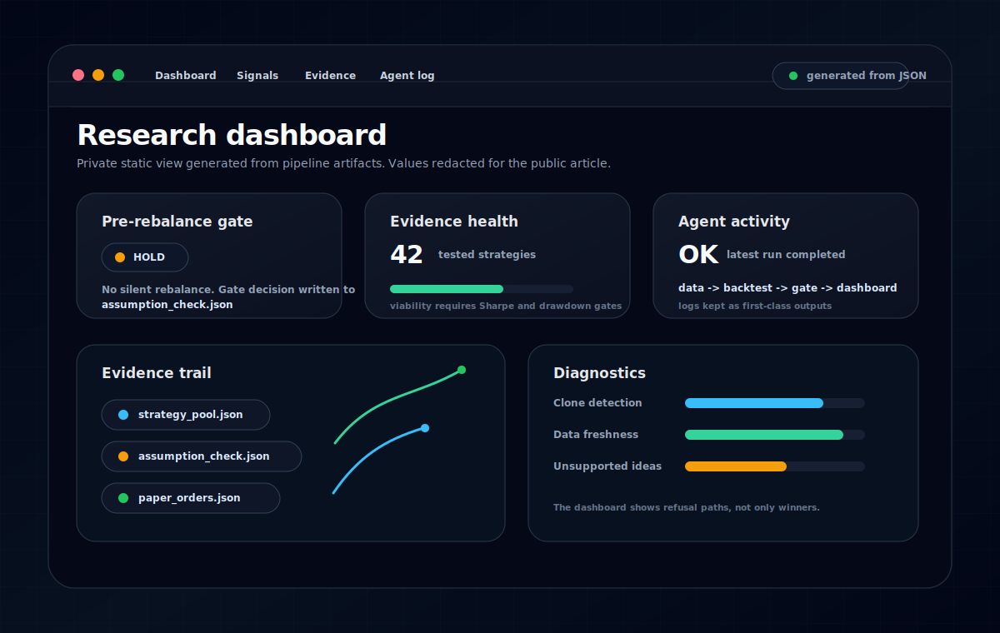

Most agent demos stop at the answer. That is the least interesting part.

In equity research, a polished answer is close to useless unless the work behind it can be inspected. A model can write a plausible note on a European small cap. It can summarize a chart, invent a neat reason, and sound calm while doing it. None of that means the idea survives contact with data, costs, liquidity, or time.

This project started from a narrower question: what would an agentic research loop look like if the output was not a recommendation, but a trail of evidence?

The system pulls market data, generates candidates, turns them into strategy hypotheses, runs backtests, writes diagnostics, applies a pre-rebalance gate, tracks a paper portfolio, and publishes the current state to a static dashboard.

The important part is not that agents are involved. The important part is that every stage leaves receipts. Every candidate should be rejectable. Every rebalance should be able to end in `proceed`, `hold`, or `abort`.

## The failure mode is fluent nonsense

The dangerous version of this system would be easy to build.

Give an agent access to market data. Ask it for European equity ideas. Let it write a confident thesis. Add a dashboard. Call it autonomous research.

That is exactly the shape I do not trust.

Finance punishes systems that confuse narrative with evidence. A strategy can look good because the backtest dispatch path is too generic. A ticker can look tradable because stale data hides a liquidity problem. A paper portfolio can appear stable because missing prices quietly understate exposure. A dashboard can be freshly generated while its inputs are old.

These are not exotic failures. They are normal failures. The point of the project is to make them harder to miss.

The pipeline is therefore built around refusal. A candidate is allowed to die at multiple points: unsupported strategy type, bad data, weak backtest, clone-like result, poor drawdown, stale inputs, earnings risk, regime mismatch, broken thesis, or a pre-rebalance gate that says the evidence is not good enough today.

A research system that cannot refuse to act is not a research system. It is a content engine.

## Europe makes the toy problem disappear

The universe is deliberately constrained to European equities and PEA eligible instruments.

That constraint matters. US-first tooling often makes the problem feel cleaner than it is. European tickers are messier. Exchange suffixes matter. Coverage is uneven. Liquidity can dominate the quality of a signal. Small caps can produce beautiful backtests that would be painful to trade. Corporate actions and missing history show up in annoying places.

The pipeline cares about names like ASML, Schneider Electric, LVMH, Hermes, Air Liquide, Vusion, or 2CRSI more than another clean US mega-cap screen. It can also surface speculative small-cap setups, but only as candidates that have to survive the same evidence trail as everything else.

The first viability gate is intentionally blunt:

- Sharpe ratio above 0.5
- Maximum drawdown better than -30%

That does not make a strategy good. It just removes the obvious waste before the system spends more attention on it.

The more interesting checks come later: transaction costs, turnover, bear-market behavior, market regime, earnings proximity, thesis health, sector exposure, data freshness, and whether a batch of strategies secretly produced the same result.

## The gate is more important than the generator

Idea generation is cheap now. Refusal is the scarce part.

The strongest component in the pipeline is the pre-rebalance gate. Before the paper portfolio changes positions, the system asks whether the reason for acting still exists.

It checks strategy fitness, market regime, data freshness, earnings risk, thesis health, and sector rotation. The output is deliberately plain: `proceed`, `hold`, or `abort`.

That small vocabulary changes the character of the whole project.

Most automation has an action bias. It wants to produce a trade, a note, a chart, a recommendation. In research, doing nothing is often the highest quality output. `Hold` is not a failure case. `Abort` is not an error. They are part of the product.

A backtest is evidence, not permission. A good historical result can still be a bad action today if the assumptions have moved underneath it.

## The dashboard is a ledger

The dashboard is not there to make the project look finished. It is there to expose state.

It shows what ran, what changed, what passed, what failed, and what the system refused to do. Signals are only one page. The more important pages are evidence, agent logs, health, assumptions, diagnostics, rejected ideas, and stale-data warnings.

This is not a mockup. The running dashboard is generated from files written by the pipeline. The public image above is sanitized, but the shape is the same: JSON artifacts in, static pages out.

The stack is intentionally plain:

- Python for data collection, screening, backtesting, and report generation
- Jinja2 for static templates
- Cron for scheduled runs
- JSON and CSV files as system state
- Caddy serving the private dashboard

A static dashboard has fewer moving parts than an app server. JSON artifacts are easy to diff, copy, inspect, and back up. If something matters, it should leave a file behind.

## What actually runs

The pipeline is a control loop, not a chatbot session.

A data job refreshes prices and universe files. A discovery job adds strategy hypotheses. A backtest job tests pending ideas and marks them viable only if they clear the gates. A selection job chooses candidates for the paper portfolio. A paper-trading job turns selected strategies into target positions. A dashboard job renders the current state into static pages.

Each step writes artifacts the next step can inspect:

- strategy candidates live in a strategy pool
- backtests write metrics, risk checks, and viability flags
- batch diagnostics look for clone results and extreme outputs
- the assumption checker writes a `proceed`, `hold`, or `abort` decision
- paper trading writes target orders and portfolio state
- the dashboard renders those files without inventing a story

The design is less elegant than a single agent that "does research". It is also much easier to debug.

When something looks wrong, the question is not "what did the agent mean?" The question is "which artifact changed, and why?"

## The useful bugs were embarrassing

The best improvements came from results that looked good for the wrong reason.

Early strategy variants sometimes produced identical backtest outputs. That could have been mistaken for robustness. It was not. In one batch, separate variants came back with the same Sharpe, maximum drawdown, CAGR, and trade count. That was the tell: the strategy definitions were falling into the same generic dispatch path.

The fix was not just to patch the dispatch bug. The fix was to add batch diagnostics after every run so clone-like results become visible immediately.

Another class of ideas could not be backtested honestly with the current engine. Fundamentals, intraday logic, and options strategies do not fit a daily-price backtester. Forcing them through would create clean-looking nonsense. The pipeline now detects unsupported strategy types and skips them instead of manufacturing precision.

Good automation should make bad states visible, not prettier.

## What the agents are allowed to be

I do not think of the agents as portfolio managers. That gives them too much credit.

They are closer to research operators. They gather data, expand candidate sets, draft hypotheses, run checks, inspect failures, and package outputs. They are useful because they are tireless, not because they are inherently trustworthy.

Trust comes from the surrounding system: schemas, saved artifacts, diagnostics, gates, dashboards, and a workflow that is comfortable saying no.

The agent can propose. The pipeline has to preserve the evidence. The human still has to judge.

## What this does not prove

This project does not prove that agents can pick stocks.

It does not prove that a backtested signal will survive live trading. It does not remove liquidity risk, survivorship bias, corporate-action mess, overfitting, or the basic problem that markets change.

That is the wrong standard anyway.

The project is useful if it makes exploratory research repeatable enough to inspect. It should produce better questions, not pretend to produce final answers. It should make weak assumptions uncomfortable. It should turn a fluent thesis into a set of artifacts that can be checked, rejected, or watched over time.

Paper trading is part of that discipline. It is a reality check, not a victory lap.

The shorter project page is here: [Autonomous research pipeline](/projects/autonomous-pea-research-pipeline/).

I also wrote a follow-up series on the build process behind the system:

- [I wrote 76KB of docs before letting the AI build](/posts/spec-before-code-ai-build/)
- [Why I made the AI stop before every commit](/posts/gates-as-design-opportunities/)
- [When mocks lie](/posts/when-mocks-lie-integration-test-gap/)

## The lesson

I started with a question about autonomous research. I ended up caring more about refusal.

The best part of the system is not that it can generate ideas. It is that it can preserve the work, expose the diagnostics, and sometimes decline to proceed.

That is the standard I would apply to most agentic workflows now. Do not ask whether the agent can produce an answer. Ask whether it leaves enough behind for someone serious to inspect it.
