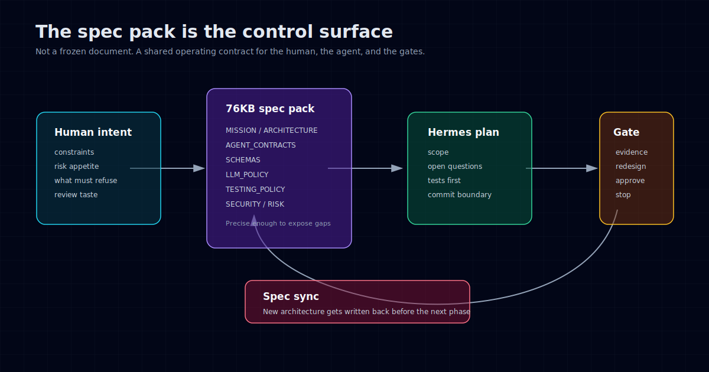

Most AI coding demos start with a prompt.

Mine started with 76KB of markdown.

Before the first real line of code, I wrote a spec pack: more than thirty documents covering the mission, architecture, agent contracts, schemas, orchestration, testing policy, security, risk policy, scoring rules, trading rules, dashboard behavior, notifications, and the build agent's own operating instructions.

That sounds excessive. In some projects it would be.

For this one, it was the difference between "let an agent code until something exists" and "build a system I might eventually trust with money."

The project is an autonomous European equities research and paper trading system. It is not supposed to be a chatbot that says whether ASML looks interesting. It is supposed to pull data, classify a European equity universe, run research agents, preserve evidence, backtest ideas, refuse weak signals, update a paper portfolio, and expose the trail through a dashboard.

That kind of system has too many ways to look correct while being wrong.

A ticker can be eligible by accident. A strategy can pass because the backtest dispatch path was too generic. A paper portfolio can look stable because missing prices quietly hide exposure. An agent can produce a beautiful thesis that has no connection to the artifacts behind it.

So I did the boring thing first.

I wrote the contract.



## The docs were not ceremony

The spec pack lived under `/docs/`.

The top-level files were the obvious ones:

- `MISSION.md`
- `PRODUCT_SPEC.md`
- `ARCHITECTURE.md`
- `BUILD_PLAN.md`

Then came the files that mattered more than they sounded:

- `AGENT_CONTRACTS.md`
- `SCHEMAS.md`
- `ORCHESTRATION.md`
- `LLM_POLICY.md`
- `TESTING_POLICY.md`
- `SECURITY_POLICY.md`
- `RISK_POLICY.md`
- `SCORING.md`
- `TRADING_RULES.md`
- `DASHBOARD_SPEC.md`
- `DECISIONS.md`

There were also ADRs for the load-bearing choices, plus `prompts/HERMES_SYSTEM.md`, which defined how Hermes, the AI build agent, should behave while building the project.

This was not a documentation exercise. I was not trying to produce pretty docs for some future reader.

I was trying to make the system harder to improvise.

That distinction matters. A normal project spec often says what should exist. This spec also said what must not happen.

The orchestrator must not call execution directly. LLM calls must go through a controlled client. Live network tests must be blocked unless explicitly gated. Broker credentials must be empty until real trading is deliberately enabled. Agents must communicate through persisted state, not direct function calls.

The point was not to describe a system after the fact. The point was to constrain the build before the agent got clever.

## Why not just start coding?

For a small project, starting with code is often right.

You learn faster by building the thing than by describing it. A prototype teaches you where the real problem is. Most specs written too early are just guesses with formatting.

But autonomous systems have a different failure mode.

The first version of the architecture tends to calcify. Once an agent has created files, imports, schemas, tests, and fixtures, the project starts developing gravity. Later changes become refactors instead of choices. Bad boundaries become normal because the test suite was built around them.

That is especially dangerous when the builder is an AI agent.

Hermes is fast. That is useful, but speed cuts both ways. If the initial instruction is vague, the agent will still produce something coherent. It will create names, directories, interfaces, mocks, helper functions, and test patterns. Some of them will be good. Some will be subtly wrong. All of them will feel more real once they exist.

The spec pack slowed that down before it started.

It forced questions like:

- Which agents exist?
- What is each agent allowed to read?
- What is each agent forbidden to do?
- What gets persisted?
- What is only an artifact?
- What happens when the LLM provider fails?
- What is a retryable error?
- What is an unsafe error?
- What is a paper trade?
- What has to be true before live trading can even be considered?
- What evidence does a phase need before it can close?

A lot of those questions are annoying to answer before code exists.

That is why they are useful.

## The spec was a control surface

The build process had a rule: no non-trivial checkpoint starts with code.

Hermes first proposes a plan. The plan has scope, tests, open questions, proposed answers, and a commit message. I review it, answer the questions, add constraints, or reject the direction. Only then does implementation start.

That only works if the agent has a shared design language to draw from.

The spec pack gave it that language.

When Hermes planned Phase 2, it did not have to invent what an agent contract meant. `AGENT_CONTRACTS.md` already defined the idea. When it implemented LLM fallback behavior, `LLM_POLICY.md` already said safety violations must not be laundered through fallback. When it wrote orchestration tests, `ORCHESTRATION.md` already described the dependency model.

The docs were not there to make the agent obedient in a vague way. They were there to reduce the number of decisions hidden inside implementation.

Every time the agent made a plan, I could compare it to something written down.

That changes the review conversation. Instead of saying "this feels wrong", I could say "this violates the import boundary in the orchestration spec" or "this should be a schema-level decision, not an executor-level decision."

It made review less personal and more mechanical.

That is good. Mechanical review scales better when the human is tired.

## The spec was allowed to be wrong

The important part is that the spec was not sacred.

It was a starting point, not a constitution.

Some of the best architecture came from moments where the spec was incomplete.

In Phase 2.4, the run graph originally treated agents as the graph nodes. That sounds fine until `RiskAgent` appears twice in the daily run: once before allocation, once after paper trading.

If the graph key is just `AgentName.RISK`, which RiskAgent run does another node depend on?

That question came up at a checkpoint gate. The answer was to separate `node_key` from `agent_name`.

```python
RunTemplateNode("risk_preflight", AgentName.RISK, ("backtest",))
RunTemplateNode("risk_post_trade", AgentName.RISK, ("paper_trader",))
```

The same implementation can now appear twice in the graph without pretending it is the same node. Dependencies point to node keys, not agent names.

That design is obviously better in hindsight. It was not in the first spec.

In Phase 2.5, a similar thing happened with execution schemas. The first plan placed `OrderIntent` and `ExecutionResult` in `app.execution.interface`. During review, Hermes noticed the import smell: future agents would need to type-hint execution requests, which would force them to import the concrete execution package.

The fix was to move neutral boundary schemas into `app.schemas.execution` and keep concrete execution code in `app.execution`.

Again, better architecture. Again, not from the initial spec.

The lesson was not "write a perfect spec."

The lesson was "write a spec precise enough that its gaps become visible."

## Foundation is not feature work

Phase 0 did not produce an impressive dashboard.

It validated the repo bootstrap.

Phase 1 built the backend foundation.

Phase 2 shipped contracts, schemas, orchestration, retry policy, LLM fallback, and execution interfaces. Many of the agents had no behavior yet. That can feel unsatisfying if you measure progress by visible features.

But foundational phases should not be judged that way.

A contract is not implementation. It is a promise about future implementation.

Phase 2 produced 12 agent contracts before those agents existed as useful workers. That was intentional. The system needed to know what a DataAgent, KnowledgeAgent, BacktestAgent, RiskAgent, AllocatorAgent, PaperTraderAgent, and ReportAgent were allowed to do before each one started accumulating behavior.

This became an explicit principle in the build plan:

> A foundational phase is complete when the contracts, schemas, interfaces, and templates required by later phases are in place, even if the agents using them are not implemented yet.

That sentence saved a lot of confusion.

Without it, every foundation looks incomplete until the end of the project. With it, scaffolding becomes a real milestone.

## The docs made refusal easier

A recurring theme in this project is refusal.

The system should refuse weak strategies. It should refuse unsupported backtests. It should refuse live network calls in normal tests. It should refuse real trading unless several explicit gates are opened. It should refuse to guess when eligibility data is missing.

The spec made refusal easier because refusal had already been written down.

For example, missing eligibility data does not become `excluded` internally. It becomes `unknown`, with `is_active=False`.

That distinction matters.

The safety property is `is_active=False`: the system must not act on the stock.

The information property is `status='unknown'`: the system must preserve why it is not acting.

If those two ideas are collapsed, you lose the ability to ask "which names are excluded because we know they are ineligible?" versus "which names are inactive because we do not know enough yet?"

That is a tiny schema decision. It is also the kind of decision that changes whether the system is auditable later.

Specs are useful for that. They give small semantic choices somewhere to live before they disappear into code.

## The spec had to be synced

After Phase 2, the code had outgrown the docs.

That was a good sign. It meant the gates were working. The project had learned things.

But stale specs are dangerous. If Phase 3 had started against the original docs, the next layer would have been built on outdated assumptions.

So before Phase 3, we did a spec sync.

Hermes listed the lessons from Phase 2. I sorted them into tiers:

- must propagate before Phase 3
- propagate when relevant
- meta-lessons about the build process

Then Hermes proposed which docs to update. Six docs changed in one commit. No code changed.

That pass captured keyed-node templates, schema location rules, eager persistence, fallback lookup behavior, and the newer safety error categories.

This is the part most projects skip.

They write docs once, then code teaches them something, then the docs slowly become historical fiction. Everyone knows the docs are wrong, so nobody reads them. Eventually the code is the only source of truth, except the code is too detailed to explain intent.

For an AI build agent, that decay is worse. The docs are not just human reference material. They are part of the agent's context. If the docs are stale, the agent plans against stale architecture.

Spec sync is not paperwork. It is context maintenance.

## What I would do again

I would absolutely write the spec pack again.

Not because the first version was perfect. It was not.

I would do it again because it created a review surface before code existed. It gave Hermes enough structure to produce useful plans. It gave me enough written intent to reject plausible but wrong implementation paths. It made the gates sharper. It made later corrections easier to explain.

The cost was a few days of slow work before anything visible existed.

That is not always worth it.

If I am building a landing page, a toy app, or a throwaway script, I do not want 76KB of docs. I want code.

But for a multi-phase autonomous system, especially one touching financial data and eventually execution boundaries, the slow start was the right trade.

The spec did not prevent redesign. It made redesign cheaper.

It did not remove judgment. It gave judgment something to compare against.

And it did not make the agent trustworthy. That is too much to ask from a document.

It made the agent's work inspectable.

That is the standard I keep coming back to with AI systems. Do not ask whether the agent can produce a lot of code. Ask whether the surrounding process makes wrong code easier to catch before it becomes architecture.

Next in this series: [Why I made the AI stop before every commit](/posts/gates-as-design-opportunities/).
