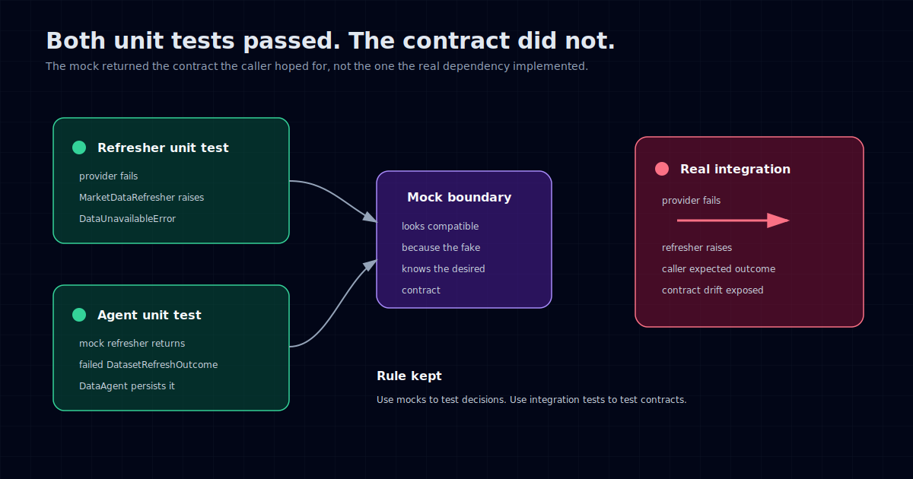

The bug was boring.

That is what made it useful.

During the Phase 3 final gate, Hermes found that `MarketDataRefresher` raised `DataUnavailableError` when all providers failed. The caller expected a failed `DatasetRefreshOutcome` instead.

Both sides had passing unit tests.

The refresher tests passed because they expected the refresher to raise. The agent tests passed because they mocked the refresher to return a failed outcome. Each side was internally consistent. The contract between them was not.

The system only broke when the real components met.

That is the kind of testing failure I trust, because it is not abstract. It is the normal, embarrassing kind.

## The setup

The system is an autonomous European equities research and paper trading project. Phase 3 was about the data layer: provider contracts, yfinance adapter, provider chain, normalized artifacts, data quality checks, market regime detection, and the first real DataAgent behavior.

The standard tests were strict. Live network was blocked by default. External calls needed both a `@pytest.mark.live_network` marker and `RUN_LIVE_DATA_TESTS=1`. Unit tests used fixtures and fakes. Provider behavior was tested without accidentally hitting the internet.

That is the right default.

But the final gate had a different job. It needed to run a small live validation basket against real services and inspect the persisted rows and artifacts.

The point was not to prove production readiness. The point was to catch the bugs that mocks are structurally bad at catching.

It worked.

## What failed

The failing path was simple.

A market data refresh could fail because providers were unavailable or returned no usable data. That failure should be represented as a `DatasetRefreshOutcome` with failed status. The DataAgent could then persist the outcome, classify the run, and continue through the expected failure path.

Instead, the refresher raised `DataUnavailableError` directly.

That skipped the outcome object the caller expected.

No unit test saw it because the unit tests had split reality in two.

On one side, `MarketDataRefresher` was tested as a component that raises on unavailable data.

On the other side, DataAgent was tested against a mocked refresher that returned the failed outcome DataAgent wanted.

Both were reasonable tests in isolation. Together, they described a system that did not exist.

## Mocks encode assumptions

Mocks are not fake reality. They are executable assumptions.

That is fine when the assumption is local: "if this dependency returns X, my code does Y." Those tests are fast, precise, and useful.

But they are dangerous at boundaries.

A mocked dependency can accidentally become more compliant than the real dependency. It can return the shape the caller hopes for, not the shape the implementation actually produces. The test then proves the caller handles an imaginary contract.

That is what happened here.

The mock knew the desired contract. The real component had drifted.

This is why I do not like the phrase "unit tests passed" as a comfort blanket. Passing unit tests mean the units behaved under the assumptions encoded in the tests. They do not prove the assumptions match across units.

You need at least one test where the real things touch.

## The fix was not just code

The code fix was straightforward: align the refresher and caller around the same failure contract.

The process fix mattered more.

During the final gate, Hermes did not silently patch the bug and continue. It surfaced the finding, classified it, and stopped.

That is the right behavior.

A gate is not a place to make the transcript look clean. It is a place to make the evidence honest.

If the agent had patched the bug inline, rerun the gate, and summarized the result as "all good," the most important information would have been compressed away. The useful fact was that the unit suite missed a contract drift. That fact should change the testing policy.

So the finding became a gate fix, not a hidden edit.

## The policy changed

The lesson for `TESTING_POLICY.md` was simple: every important layer boundary needs at least one real-components integration test.

Not a giant end-to-end suite for every scenario. Not live network by default. Not slow tests everywhere.

Just one honest crossing per boundary.

For this kind of system, the interesting boundaries are places like:

- provider chain to refresher
- refresher to DataAgent
- DataAgent to database persistence
- orchestrator to state machine
- LLM client to fallback registry
- execution boundary to paper executor

Unit tests can cover the edge cases. Integration tests should prove that the two sides agree on the basic contract.

That distinction keeps the suite practical.

If every test uses real dependencies, the suite becomes slow and brittle. If no test uses real dependencies, the suite can become fiction.

The goal is not purity. The goal is catching the specific class of lie mocks are good at telling.

## Live gates need negative controls

One detail I like in the Phase 3 gate is that it did not only test the happy path.

It had a negative control first.

The system had to prove it refused live network calls without the explicit environment variable. Only then did the gate run the positive control with live access enabled.

That order matters.

For a financial research system, accidental live access is itself a bug. A test suite that quietly calls external services is not just flaky. It is unsafe. It can hide dependency on rate limits, credentials, network state, and provider behavior.

So the gate checked the refusal path before the live path.

That pattern generalizes:

1. Prove the dangerous thing is blocked by default.
2. Enable it explicitly.
3. Run the smallest useful live validation.
4. Inspect what was persisted.
5. Map acceptance criteria to evidence.
6. Classify surprises before fixing them.

That is more work than a normal test run. It should be. It is a phase gate, not a pre-commit hook.

## Why this matters more with AI agents

AI build agents make this failure mode easier to create.

They are good at producing coherent local tests. If a function needs a dependency, they can mock it. If a caller expects a shape, they can build a fake that returns that shape. The resulting test suite can look thorough while still avoiding the real boundary.

That is not because the agent is bad. Humans do the same thing.

The difference is speed. An AI agent can generate a lot of plausible tests quickly, which means a false sense of coverage can appear quickly too.

The answer is not to distrust every test the agent writes. The answer is to ask what the test is proving.

Does it prove local logic under a mocked assumption?

Or does it prove that two real components agree?

Both are useful. They are not interchangeable.

## The boring bugs are the point

The F2 bug was not clever. It was not an exotic race condition or a deep financial modeling issue.

It was a mismatch between raising an exception and returning a failure object.

That is exactly why it belongs in the process.

Most production bugs are not cinematic. They are boring disagreements at boundaries. One layer thinks failure is a value. Another layer thinks failure is an exception. One function thinks timestamps are creation time. Another thinks they are start time. One module thinks a schema belongs to execution. Another needs to import it without depending on execution.

Good gates catch those disagreements while they are still cheap.

## The rule I kept

After this, my testing rule got simpler:

Use mocks to test decisions. Use integration tests to test contracts.

If the question is "what should this unit do when the provider returns no data?" a mock is fine.

If the question is "what does the provider chain actually return to the refresher, and what does the refresher actually return to the agent?" a mock is the wrong tool.

That sounds obvious. It is still easy to forget when the test suite is green and the agent has produced a convincing summary.

The dangerous mock is not the one that returns fake data. It is the one that returns the contract you wish you had.

The green check is not the artifact I trust most.

I trust the boundary test where the real things meet.

Previous in this series: [Why I made the AI stop before every commit](/posts/gates-as-design-opportunities/).
