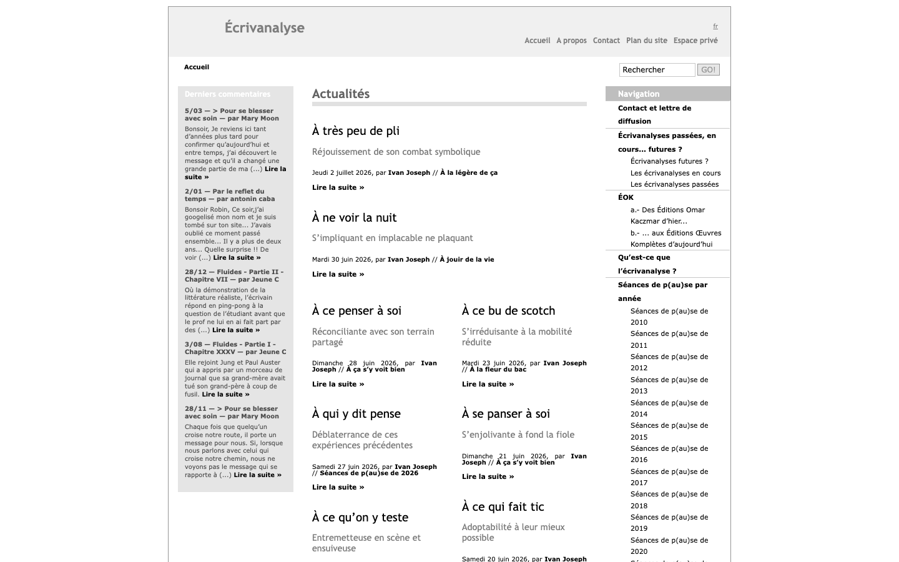
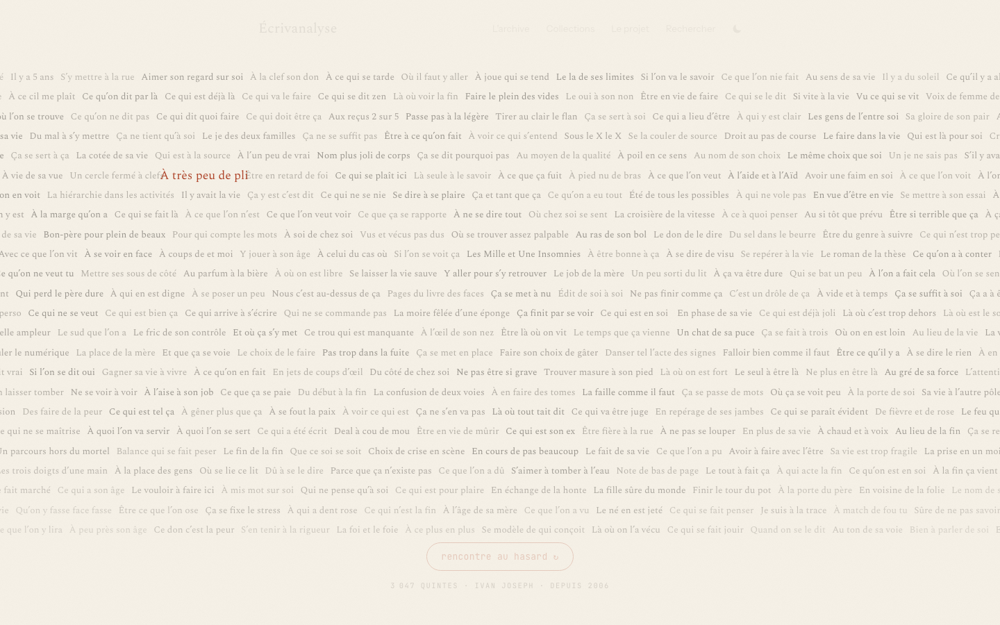
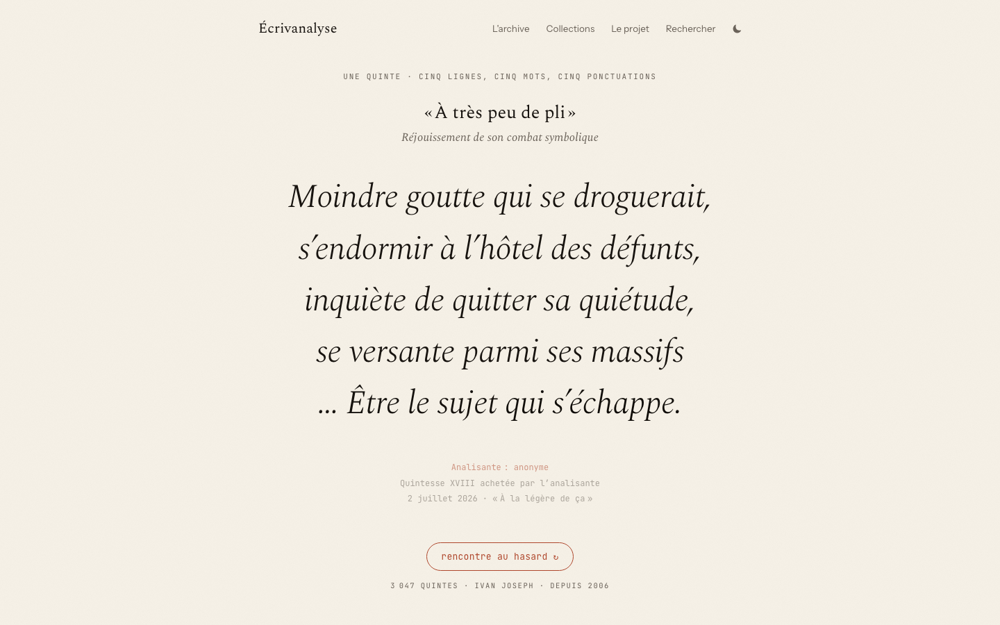

I thought I was rebuilding a website. The first serious problem was a noun.

Ivan Joseph has practiced _écrivanalyse_ since 2006. It borrows the setting and vocabulary of psychoanalysis, but writing takes the place of analysis and there is no therapeutic claim. A session produces a short text called a _quinte_. Ivan writes it on a sheet of paper called a _quintesse_, which the participant may acquire.

I initially treated those two words as interchangeable. They are not. One names the writing and the other names its physical object. Get that distinction wrong and the error spreads everywhere: navigation, metadata, search results, page titles, even the sentence that explains what the site contains.

That correction changed the project. I was no longer moving pages from SPIP to Astro. I was trying to learn the archive's language well enough to rebuild it without sanding off the parts that made it Ivan's.

## Recover first, redesign later

The original site had accumulated work from 2009 to 2026 in SPIP 3.2.8. Before touching the interface, I wrote a crawler and made a public backup of its HTML, media, structured data, and old addresses. A redesign can be repeated. A disappearing source cannot.



_The original home page. This is what ecrivanalyse.net served until the migration - with fresh sessions from July 2026 on the front page. The practice never stopped; only the software aged._

The crawl found 3,157 published pages, but that number hid a classification problem. The old site's article type described storage, not meaning. A short quinte, a chapter of prose, a project page, and a contact page could all look like the same kind of record to a scraper.

After reading the corpus and correcting the parser, the archive resolved into:

- 3,047 quintes, including 39 whose text was never published online and one embedded inside a longer piece of prose
- 97 longer texts from works such as _La petite fille à côté_, _La danseuse de vélo_, and _Fluides ou Le singulier pluriel_
- 11 documentary pages worth republishing, with two obsolete contact pages left out

Those exceptions mattered more than the clean majority.

The 39 "ghost" records describe real sessions and real quintesse, but the corresponding quintes only exist in the printed collection _Faire une quinte de tout_. The new site says so. Inventing an empty text, dropping the pages, or pretending the scrape had failed would all falsify the archive in different ways.

Page 154 had the opposite problem. Its quinte sits inside prose and completes the surrounding thought. Pulling it out into a large display block made the individual lines prettier and the piece less faithful. The content model now keeps the lines as structured data while a small `<quinte>` marker preserves their exact place in the prose.

Even the counting rules fought back. A quinte is associated with five lines, five words per line, and five punctuation marks. That is a characteristic form, not a validator. The corpus contains exactly one six-line quinte, no. 1024, written in a 2013 street session and acquired by its participant:

> Le doigt à la bague,\
> acte spontané à la réflexion :\
> rehaussants cothurnes à poil, carcan\
> peu plus légèrement gauche, trans-parent\
> noir maternel sophistiqué d’un bermuda-jupe\
> cache-miré fluorescent sur mollets demi-gris…
>
> — Ivan Joseph, « On est né d’ici là », 2013

A stricter pipeline would have rejected that sixth line or trimmed it. The archive keeps it and simply records that it is not 5 by 5. Early versions of the parser were less humble: they lost 42 real records because they mishandled the `œ` ligature, initials such as `O.R.L.`, styled line breaks, and punctuation dashes. The more confidently I enforced a perfect 5 by 5 shape, the more real work disappeared.

## The corpus wrote the schema

Once the categories were honest, the storage became simple. Every quinte is a YAML file with its title, one-line description, lines, participant, mode, date, collection, quintesse number, and status. The longer texts live in a separate collection. Astro turns them into static pages.

Here is one entry, exactly as it lives in the repository:

```yaml
id: 1000
title: "Le trop à la légère"
soustitre: "Voyourisme flambé au champagne volé"
lines:
  - "À l’air de sang foutre,"
  - "ne faire courir que soi :"
  - "bosse sur bouton de peau,"
  - "intrigue intègre qui se flâne,"
  - "c’est son occupation de l’esprit…"
is_5x5: true
mode: "pause"
participant_role: "pauseuse"
participant_name: "anonyme"
quintesse_num: ""
status: "inachevée avec la pauseuse"
collection: "Séances de p(au)se de 2012"
recueil: ""
date: "2013-04-19"
author: "Ivan Joseph"
```

The important field is the least database-like one: `status` is free text.

Ivan's statuses include ordinary phrases such as _achetée par l'analisante_, but the vocabulary keeps mutating. The archive contains forms such as _anniverchetée_ and _achetée-confiturée_. An enum would be tidier. It would also erase the joke the first time an unfamiliar status arrived.

This became a useful rule for the whole rebuild: regularity in the software should not require regularity from the work. The schema can insist that a status exists without pretending to know every status Ivan may write next.

The same applies to spelling. An _analisant_ uses an "i" because that is Ivan's term. A street participant is a _p(au)seur_ or _p(au)seuse_. The interface does not autocorrect either one. Product language often gets treated as a layer added after the model. Here, it was the model.

## A wall that gives way to one voice

With 3,047 quintes, a conventional home page would become a menu with a literary project hidden behind it. I wanted the first screen to make the size of the archive felt, then get out of the way.

The landing page begins as a wall of every title. They appear in patches rather than in a top-to-bottom sweep. One title lights in ochre, the rest recede behind a paper veil, and the camera moves toward the selected quinte. Its words are then revealed from left to right by a small point of ink. Commas create a pause. A line break takes a little longer. When the writing finishes, the navigation fades until the visitor moves again.



_The wall at the moment of selection: every title is present, one has just come forward._

The sequence is deliberately singular. There is no ambient motion after it ends. A click skips whatever phase is running, and reduced-motion preferences receive the finished composition immediately.

Several implementation details came directly from watching the idea fail.

Animating 3,000 titles separately was wasteful, so the wall groups them into 16 bands. Enlarging the whole wall made its browser raster visibly soft, so the wall now fades before the softness reads while a full-resolution copy of the selected title flies into its final position. The copy only scales up to its natural size, which keeps it sharp.

I also made every title non-interactive. That sounds perverse until you try to click a word during a two-second camera move. At that moment a click already means "finish the animation." Giving the same gesture a moving link target made both behaviors unreliable. The wall is texture. The archive page is the stable, keyboard-accessible list.

Only 90 entries are included in the initial page. "Rencontre au hasard" can still reach every readable quinte. During the short selection beat, the browser fetches a small JSON file for the chosen text. It remembers recently seen IDs locally and favors an unread one. The newest quinte still gets a visible seat and becomes the first encounter when it has not been seen before.

The result is not random decoration. It expresses the archive's basic movement: thousands of titles become one encounter, then return to the mass.



_Where the sequence lands: one quinte, still, with its record - and the interface out of the way._

## Old URLs are part of the work

The easiest migration would have published the new routes and accepted that old links would break. That would be a strange way to preserve an archive.

Écrivanalyse had seventeen years of indexed SPIP addresses. People had linked to individual articles, collections, author pages, and search results. The new 404 page recognizes those old shapes and routes them to their current equivalents. `articleN` finds the matching quinte or text. `rubriqueN` finds its collection. Old search URLs keep their query.

That work is mostly invisible, which is exactly right. A reader following a link from 2012 should reach the writing, not learn about the migration.

The rest of the publishing system follows the same idea. Every entry has a static HTML page. Pagefind builds search over the result. Open Graph cards are generated per quinte, so a shared link carries the writing rather than a generic brand image. The site can run without an application server, and the corpus remains legible as files in the repository.

Static did not mean small. The production build contains nearly 17,000 files and weighs about 275 MB. That ruled out one host with a 20,000-file deployment ceiling and made GitHub Pages deployments flaky enough to warrant one automatic retry. The site also needs a separate Worker before reader responses can be accepted, because GitHub Pages cannot run the moderation endpoints.

Those are acceptable seams. I would rather see the boundary than hide it behind a larger system.

## What I would carry into the next archive

I started this project looking at templates and ended up reading status phrases.

That was the better order. The visual direction only became obvious after the corpus had names, exceptions, and history. The parser improved when it stopped treating the form as a cage. The landing page improved when it stopped treating the archive as a grid of links. The migration became credible when old addresses worked again.

A technically clean archive can still be wrong. It can rename the work, normalize its odd vocabulary, discard incomplete records, and break every route people used to reach it. None of those failures shows up in a Lighthouse score.

The useful test is more specific: can someone follow an old link, meet the right kind of work, understand what is present or absent, and still recognize Ivan's language when they get there?

That is what I wanted this rebuild to do. The code is new. The archive did not have to become less strange to fit inside it.

[See the project and live embed](/projects/ecrivanalyse/), or [browse the source on GitHub](https://github.com/Ngopimas/ecrivanalyse).
