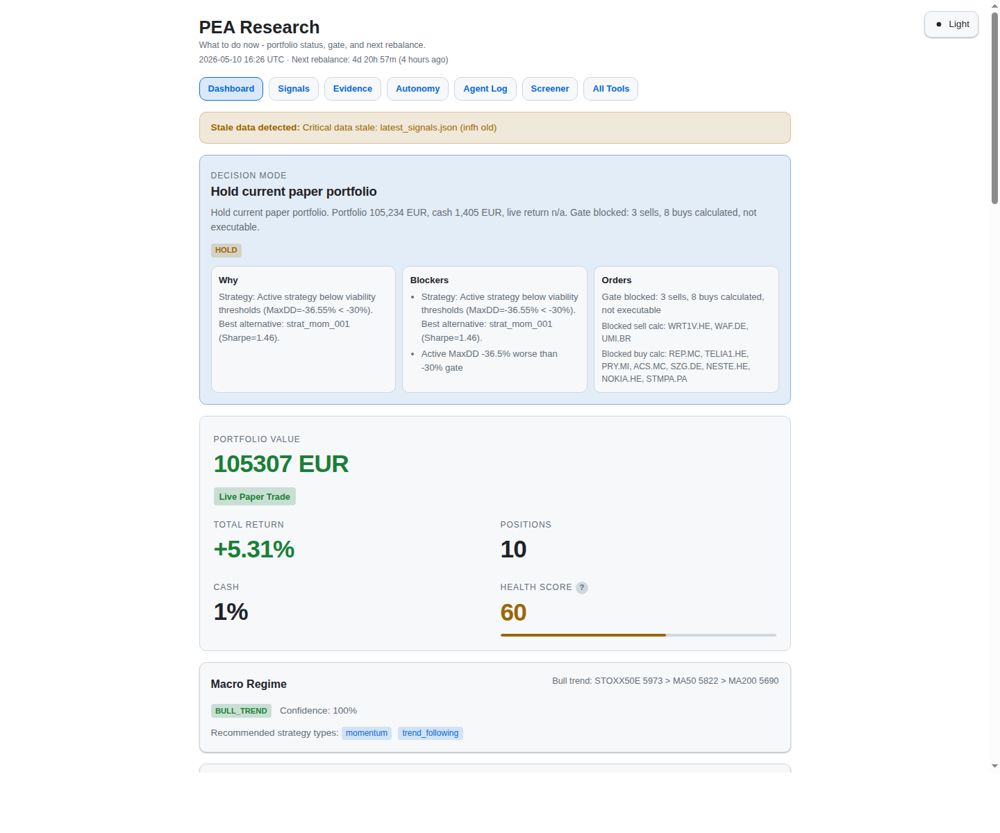
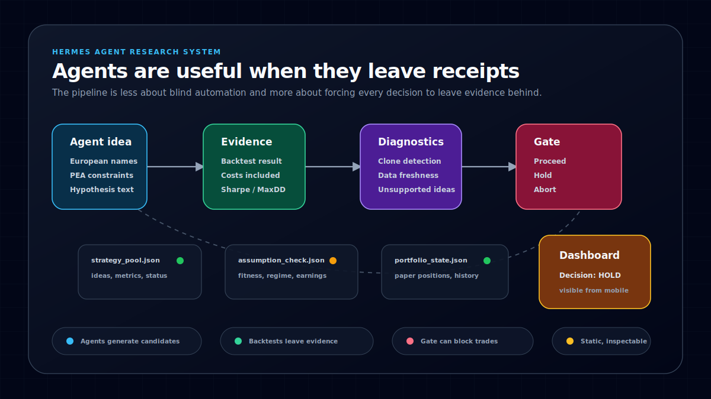
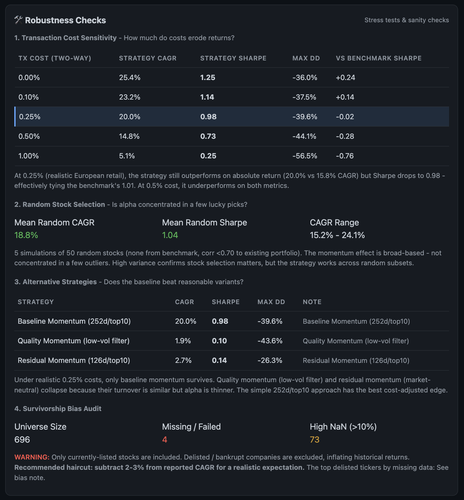

I designed and built an autonomous European-equity research prototype on Hermes AI, an agent runtime similar to OpenClaw.

It screened PEA-eligible companies, generated strategy hypotheses, backtested them with costs, ran diagnostics, tracked a paper portfolio, and published each run to a static dashboard.

During one run, it calculated eleven paper orders and placed none. The active strategy had breached its drawdown limit, so the pre-rebalance gate returned `hold`.

That is the run I had hoped to see. Finding ideas was easy enough. I wanted the system to show when those ideas should not be trusted.

## What I built

Most agent demos end with an answer. In equity research, the work behind the answer is the part worth inspecting.

A model can write a plausible thesis about a small cap. That thesis means little until it survives bad data, transaction costs, thin liquidity, and a strategy definition that may be wrong.

European equities make those problems hard to avoid. Coverage is uneven, exchange suffixes matter, and an attractive small-cap backtest may describe a trade that would be painful to execute.

I built the route from candidate to portfolio as a series of explicit jobs:

- refresh prices and the candidate universe
- generate hypotheses from research signals and factor conditions
- backtest each strategy with transaction costs
- reject weak, unsupported, or suspicious results
- select viable candidates for the paper portfolio
- run a final gate before changing positions
- publish the evidence, decisions, logs, and health checks

I owned the job boundaries, artifact flow, backtests, diagnostics, gate rules, paper portfolio, dashboard, and deployment around Hermes AI.

Each stage writes JSON or CSV artifacts that the next stage can inspect. Python runs the research jobs, Jinja2 renders the pages, cron schedules the loop, and Caddy serves the private dashboard.

I chose plain files and static pages so a bad run could be reconstructed without relying on an agent's summary of what happened.

## The result that looked too good

An early batch produced several strategies with identical Sharpe ratios, drawdowns, returns, and trade counts. It looked like independent confirmation. It was actually one backtest path wearing several labels.

I fixed the dispatch bug, then added batch diagnostics to flag clone-like results after every run. The fix covered the immediate bug and made the same class of failure easier to catch later.

Another group of hypotheses did not fit the engine at all. A daily-price backtester cannot test fundamentals, intraday logic, or options strategies honestly, so the pipeline records them as unsupported.

## The control model

Passing a backtest only moves a strategy to the next check. The paper portfolio still needs a current reason to trade.

Before positions change, the gate checks strategy fitness, market regime, data freshness, earnings risk, thesis health, and sector rotation. It writes one decision: `proceed`, `hold`, or `abort`.

Without that gate, the loop would keep moving from a promising backtest to calculated orders. A blocked rebalance still leaves its proposed orders and reasons behind for review.

The dashboard is built from the files written during each run. It shows what ran, what changed, what failed, which data is stale, and why a candidate passed or never reached the portfolio.

## Outcome

The result was a working paper-research prototype with persisted evidence, scheduled runs, diagnostics, portfolio state, and an interface that exposed failure instead of cleaning it up.

It caught clone-like backtests, refused unsupported strategies, surfaced stale state, and blocked paper orders when the active strategy no longer met its risk threshold.

The prototype was never meant to prove that an agent can pick stocks. It tested whether autonomous research could remain inspectable enough to challenge, reject, or stop its own output.

Backtests can flatter weak ideas. In European small caps, liquidity may matter more than signal quality. Data coverage, corporate actions, missing history, and survivorship bias still limit what the results can prove.

Paper trading does not solve those problems. Its value here was narrower: exposing when an idea was too weak, stale, illiquid, or convenient to trust.

A large refactor made the cost of extending the original architecture clear. I retired the prototype and carried its artifact model, diagnostics, and approval gates into a cleaner second build.

The longer build note is [Agents are useful when they leave receipts](/posts/building-autonomous-pea-research-pipeline/). The rebuild starts with [I wrote 76KB of docs before letting the AI build](/posts/spec-before-code-ai-build/).
