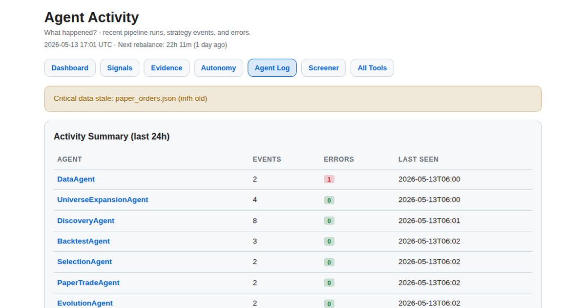

Most agent demos optimize for output. This project optimizes for auditability.

It is an exploratory Hermes Agent research loop for European equities and PEA eligible instruments. The system screens a constrained universe, generates strategy hypotheses, tests them with costs, applies diagnostics, tracks a paper portfolio, and publishes the evidence to a static dashboard.

The point is not to make an agent sound like an investor. The point is to make every candidate leave enough evidence to be challenged.

## The constraint

European equity data is messy enough to expose lazy automation quickly.

Ticker formats vary. Coverage is uneven. Liquidity matters. Small caps can produce attractive historical charts that would be difficult to trade. A clean-looking backtest can hide stale prices, thin samples, high turnover, or a strategy definition that accidentally falls through a generic code path.

That makes the domain useful for testing agentic research. The system has to preserve uncertainty instead of smoothing it away.

## System shape

The pipeline runs as a control loop:

- refresh market data and candidate universes
- generate strategy hypotheses from research signals and factor conditions
- backtest candidates with transaction costs
- mark strategies viable only after risk filters
- detect clone-like or unsupported backtests
- select candidates for a paper portfolio
- run a pre-rebalance gate before acting
- publish signals, evidence, agent logs, and health checks to static pages

The implementation is deliberately plain: Python, JSON artifacts, Jinja2 templates, cron, and Caddy. That is a feature. The fewer hidden services involved, the easier it is to inspect what happened after a run.

This is not a mockup. The running dashboard is generated from artifacts written by the pipeline.

## Stack

- Python workers for data, strategy generation, backtesting, and paper trading
- JSON and CSV artifacts as the system state
- Jinja2 templates for static dashboard pages
- Cron for scheduled runs
- Caddy for serving the private dashboard

## The skeptical part

The pre-rebalance gate is the center of the project.

Before the paper portfolio changes, the system checks whether the reason for acting still holds. It looks at strategy fitness, market regime, data freshness, earnings risk, thesis health, and sector rotation. The result is one of three states: `proceed`, `hold`, or `abort`.

That matters because autonomous systems tend to have an action bias. They are built to produce something. In research, a good system should often refuse. `Hold` is not a failure. It is a safety feature.

## Evidence trail

The dashboard is a ledger, not a showcase.

It exposes the artifacts that matter:

- generated hypotheses
- backtest metrics and viability flags
- rejected or unsupported strategy types
- clone diagnostics
- pre-rebalance decisions
- paper orders and portfolio state
- agent logs and health checks
- stale-data warnings

If a candidate survives, there should be a visible reason. If it fails, that failure should be visible too.

## What still breaks

The system is intentionally not presented as an alpha machine.

Backtests can flatter weak ideas. European small-cap liquidity can dominate signal quality. Data coverage is uneven. Corporate actions and missing history still need attention. Paper trading is useful, but it is not proof of robustness.

Those limitations are part of the design brief. The project is less about predicting returns and more about building a research process that makes weak assumptions visible before they become decisions.

I wrote more about the build in [Agents are useful when they leave receipts](/posts/building-autonomous-pea-research-pipeline/).
