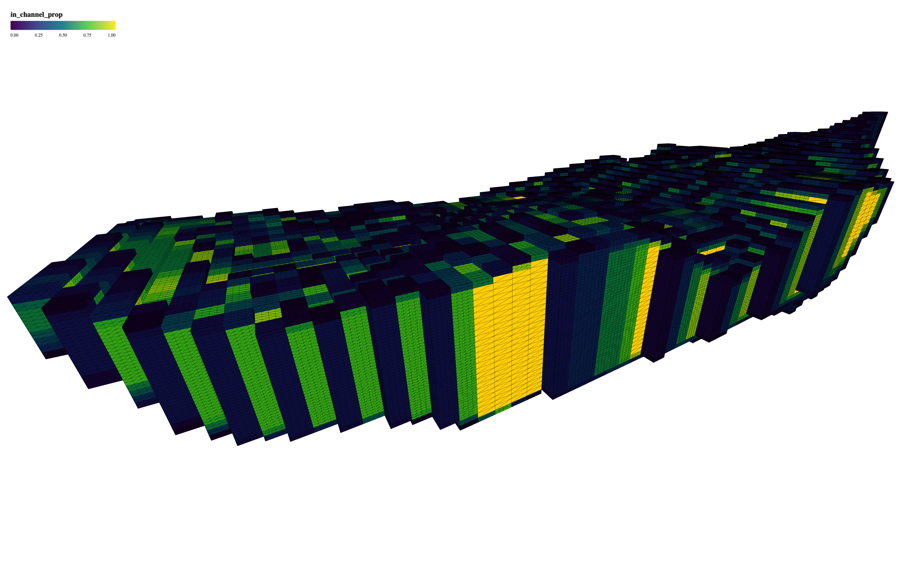

A block model is easy to store and hard to inspect.

The data is a 3D grid of blocks, each carrying geological properties. In specialist desktop software, that makes sense. In a browser, a naive implementation turns into a wall of cubes and a dead frame rate. This project was a proof of concept for making that kind of model explorable from a web page.

## The constraint

The hard part is not drawing cubes. It is drawing enough of them to be useful while keeping the model interactive.

A geological user needs to slice through the volume, change the property being colored, inspect patterns, and share a view. If the tool only shows the outside of the model, it hides the point. If it renders every block independently, it becomes too slow to use.

## System shape

The viewer includes:

- 3D rendering for block model datasets
- instanced mesh rendering for large numbers of blocks
- property-based coloring for geological attributes
- cross-section controls across X, Y, and Z axes
- a screenshot workflow for sharing model views

The interface stays close to the domain task: choose a property, cut through the model, rotate the view, and capture the result.

## The hard part

Instancing solved the first performance problem, but not the whole product problem.

The model still needed filtering, sensible defaults, and controls that did not require a tutorial. Geological users already understand the data. The interface should not make them learn a separate visualization vocabulary before they can inspect it.

That is the useful lesson from the POC: performance work and product simplification are the same problem when the dataset is this visual.

## Stack

- React and TypeScript
- Three.js and React Three Fiber
- Vite
- Apache Arrow for efficient data handling

<iframe src="https://ngopimas.github.io/POC_BM_3D/" title="Block Model Visualization" width="100%" height="400"></iframe>
