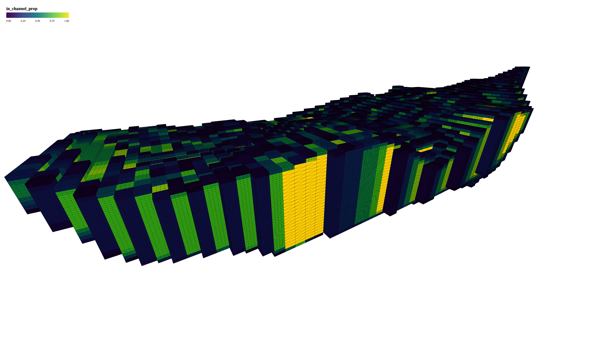

This project turns mining block model data into an interactive 3D visualization that runs in the browser.

The goal was to make geological models easier to inspect and share. Instead of opening desktop mining software for every quick look, a user can load the model, slice through it, change properties, and capture a useful view from the web app.

## What I built

- 3D rendering for large block model datasets
- Instanced mesh rendering for hundreds of thousands of blocks
- Property-based coloring for geological attributes
- Cross-section controls across X, Y, and Z axes
- A screenshot workflow for sharing model views

## The hard parts

The main constraint was performance. A block model can contain a huge number of small cubes, and rendering each one naively destroys the frame rate. I used instancing and filtering to keep interaction smooth while still letting users inspect the internal structure of the model.

The UI also had to stay simple. Geological users need slicing, colors, and properties to be obvious. If the controls require a tutorial, the tool fails.

## What it says about my work

- Practical 3D performance work in the browser
- React and Three.js implementation on a data-heavy use case
- Ability to simplify specialist workflows without removing the useful controls
- TypeScript and Vite workflow for fast iteration
- Comfort building tools for technical users in mining and geoscience

## Stack

- React and TypeScript
- Three.js and React Three Fiber
- Vite
- Apache Arrow for efficient data handling

<iframe src="https://ngopimas.github.io/POC_BM_3D/" title="Block Model Visualization" width="100%" height="400"></iframe>
