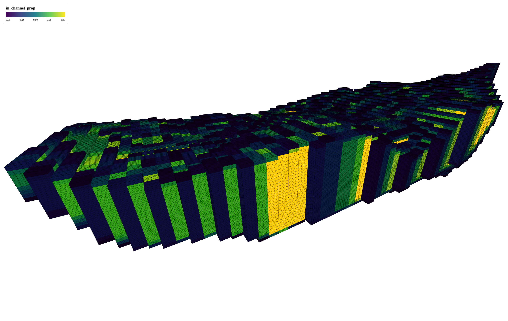

I developed a 3D visualization tool that transforms complex mining block model data into interactive, web-based 3D visualizations. This project bridges the gap between raw geological data and actionable insights, enabling mining professionals to make more informed decisions about resource estimation and mine planning.

## Business Impact

- **Improved Accessibility**: Transformed traditionally desktop-bound analysis into a web-based solution, enabling collaborative decision-making across teams and locations (e.g., geologists, engineers, and managers).
- **Cost Reduction**: Eliminated the need for expensive specialized software licenses by providing a web-based alternative for basic visualization needs.
- **Operational Efficiency**: Streamlined the process of analyzing geological data by providing intuitive cross-sectioning tools and dynamic property visualization.

## Technical Challenges & Solutions

### Challenge 1: Performance with Large Datasets

Handled large mining datasets efficiently by implementing:

- Instanced mesh rendering for hundreds of thousands of blocks
- Optimized color management system for property visualization
- Smart data filtering and rendering optimizations

### Challenge 2: Interactive Cross-Sectioning

Developed an intuitive cross-sectioning system that allows users to:

- Dynamically slice through the model along 3 axis: X, Y, Z
- Visualize internal structures and property distributions
- Maintain smooth performance during interactive manipulation

## Technology Stack

- React for component-based UI development
- Three.js and React Three Fiber for 3D rendering
- TypeScript for type-safe development
- Vite for fast development and building
- Apache Arrow for efficient data handling

## Key Achievements

- Successfully implemented a web-based 3D visualization tool that handles hundreds of thousands of blocks with smooth performance
- Created an intuitive cross-sectioning system that enables easy exploration of internal model structures
- Developed a flexible property visualization system that supports various geological attributes
- Designed a user-friendly interface that requires minimal training for geological professionals
- Implemented a screenshot feature that allows users to capture and share specific views of the model

## Future Enhancements

- **Advanced Analytics**: Integrate more advanced analytical tools to provide deeper insights into the geological data.
- **Additional Geological Objects**: Enhance visualization capabilities to include more geological objects such as drillholes, surfaces, etc.
- **Mobile Support**: Optimize the application for mobile devices to increase accessibility.
- **User Feedback Integration**: Continuously gather and integrate user feedback to improve the tool's functionality and usability.

## Conclusion

This project demonstrates the successful application of modern web technologies to solve complex visualization challenges in the mining industry. By combining powerful 3D rendering capabilities with intuitive user interfaces, I've created a tool that makes geological data more accessible and actionable for mining professionals.

<iframe src="https://ngopimas.github.io/POC_BM_3D/" title="Block Model Visualization" width="100%" height="400"></iframe>
