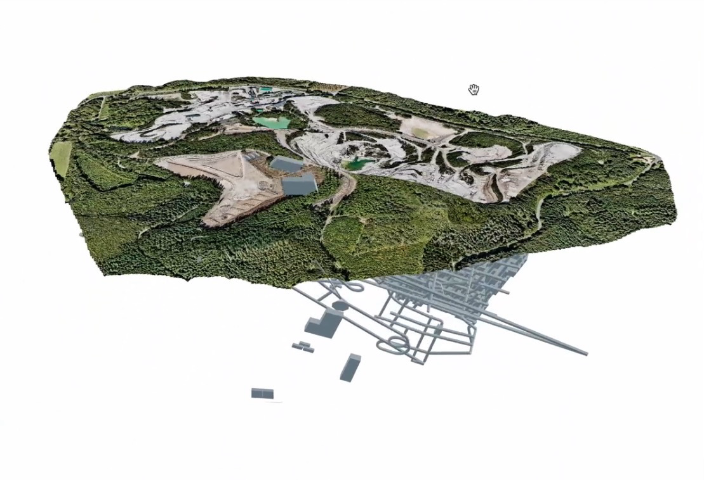

I developed a web-based 3D visualization platform for the EMILI lithium mining project by Imerys, enabling stakeholders to explore and understand the environmental and infrastructural aspects of this significant initiative in the Allier region of France. The platform serves as a crucial tool for the public debate scheduled from March to July 2024.

## Project Overview

The EMILI project represents a significant step in European industrial sovereignty, aiming to produce 34,000 tonnes of lithium hydroxide annually by 2028. My role involved creating an interactive 3D visualization platform to help stakeholders understand the project's scope and impact:

- The mineral extraction site and known mineral envelope
- The concentration plant facilities
- The transportation platform
- The conversion plant

All components are geolocated and positioned on the actual site topography, overlaid with satellite imagery.

## 1st POC Video

<video controls>
  <source src="/assets/video/emili.mp4" type="video/mp4">
  Your browser does not support the video tag.
</video>

## Technical Achievements

### Interactive 3D Visualization

- **High-Performance Rendering**: Implemented efficient 3D rendering using Three.js and WebGL
- **Responsive Interface**: Created a fluid interface that adapts to various devices
- **Intuitive Navigation**: Implemented user-friendly controls for 3D exploration
- **Interactive Layers**: Developed a system for toggling different project components

### Geospatial Integration

- **GIS Data Integration**: Utilized Mapbox for geospatial data visualization
- **Terrain Visualization**: Implemented detailed terrain rendering using topographic data
- **Real-World Context**: Combined 3D models with real-world satellite imagery
- **Georeferencing**: Integrated DXF topographic maps for accurate positioning

## Core Technologies

- **Three.js**: Utilized for 3D rendering and scene management
- **Mapbox**: Integrated for GIS data visualization
- **Vite**: Used for fast development and bundling

## Impact and Results

- **Public Engagement**: Facilitated understanding of the project's scope and impact
- **Accessibility**: Provided browser-based access to complex project information
- **Technical Excellence**: Achieved smooth performance with complex 3D data
- **User Experience**: Created an intuitive interface for non-technical users

## Future Developments

Planned enhancements include:

- Enhanced displayed information and data integration
- Additional environmental impact visualization layers
- Project progress visualization features
- Offline mode for remote areas

## Technical Challenges Overcome

- **Large Dataset Management**: Implemented efficient streaming and caching
- **Cross-Platform Compatibility**: Ensured consistent experience across devices
- **Performance Optimization**: Balanced visual quality with performance
- **Intuitive Controls**: Simplified complex 3D navigation for public users

## Further Information

- [Learn more about the EMILI project](https://emili.imerys.com/)
- [Public debate details](https://www.debatpublic.fr/mine-de-lithium-allier/le-dossier-du-maitre-douvrage-5411)
- [Visit the current EMILI 3D platform](https://emili3d.imerys.com)

<iframe src="https://emili3d.imerys.com" title="EMILI 3D Platform Demo" width="100%" height="400" allowfullscreen></iframe>
