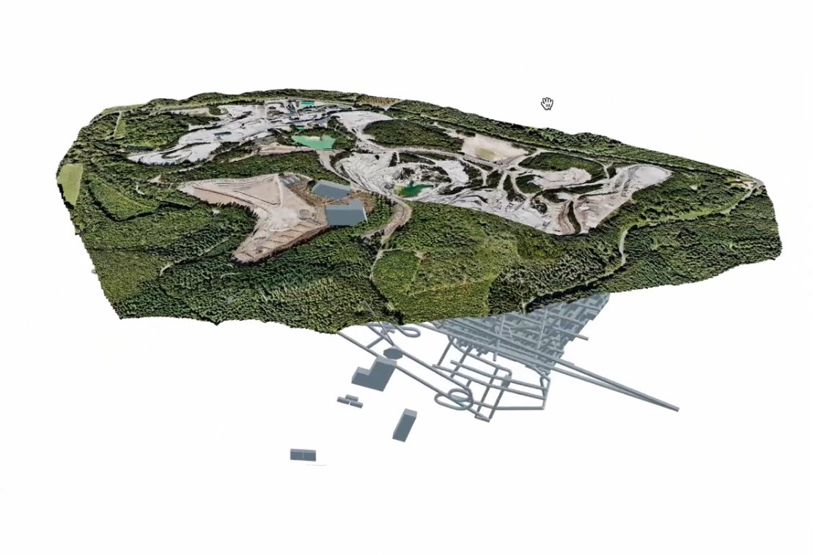

Industrial projects are hard to explain with a PDF.

The EMILI 3D platform is a browser-based visualization of Imerys' lithium mining project. It lets visitors explore the extraction site, concentration plant, transport platform, conversion plant, and surrounding terrain from a web page. The context matters because the project was part of a public debate. The interface had to help non-specialists understand the geography without pretending the infrastructure was simple.

## The constraint

Public communication around industrial sites has an awkward requirement: enough detail to be credible, not so much detail that the user gets lost.

A 3D scene can become decorative very quickly. If it only looks impressive, it does not explain anything. If it tries to include every technical object, it becomes unreadable. The product had to preserve spatial context while guiding attention to the parts of the project that mattered.

## System shape

The platform combines several layers:

- a Three.js and WebGL 3D scene
- geolocated project components
- terrain and satellite context through Mapbox
- layer controls for exploring the site
- a responsive interface for public visitors

The goal was not cinematic realism. It was orientation. A visitor should be able to understand where each component sits and how the pieces relate to one another.

## First POC video

<video controls>
  <source src="/assets/video/emili.mp4" type="video/mp4">
  Your browser does not support the video tag.
</video>

## The hard part

Browser 3D has a strict budget.

Terrain, geospatial context, models, labels, and controls all compete for performance. The scene has to stay smooth on ordinary devices, not only on a developer laptop. That means being selective about geometry, texture weight, camera behavior, and the amount of context shown at once.

The other constraint was language. The interface had to avoid turning a public exploration tool into a specialist CAD viewer.

## Stack

- Three.js and WebGL
- Mapbox for geospatial context
- JavaScript and Vite
- Georeferenced 3D and topographic data

## Further information

- [Learn more about the EMILI project](https://emili.imerys.com/)
- [Public debate details](https://www.debatpublic.fr/mine-de-lithium-allier/le-dossier-du-maitre-douvrage-5411)
- [Visit the current EMILI 3D platform](https://emili3d.imerys.com)
