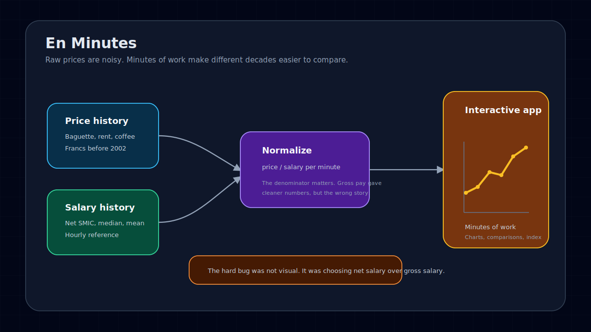
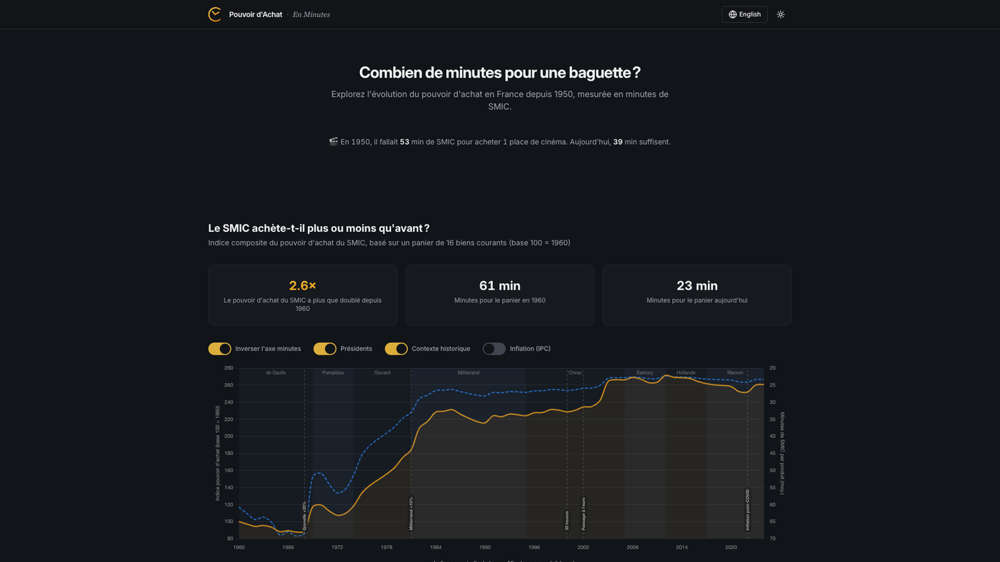

Raw prices are a bad way to talk about purchasing power.

En Minutes starts from a smaller question: what does something cost if the unit is work time instead of euros? A baguette, a coffee, a cinema ticket, rent, electricity, cigarettes, public transport. The answer changes depending on the salary reference, the period, and the method used to convert old prices.

That is why the project is more about methodology than chart polish.

## The constraint

Historical price comparisons are easy to make and easy to get wrong.

France moved from old francs to new francs, then to euros. Inflation changes nominal prices. Wages change too. Gross salary and net salary tell different stories. Minimum wage, median salary, and mean salary do not describe the same person.

If the product hides those choices, the chart becomes a trick.

## Product shape

The app lets users compare everyday French prices from the 1950s to today in minutes of work.

Users can switch between minimum wage, median salary, and mean salary. The chart recalculates in the browser, so the same product can tell different stories depending on the reference point. Some goods became meaningfully cheaper. Some did not. Some only look cheap when the salary reference is too generous.

## The useful mistake

The first version used gross minimum wage data. It made the implementation cleaner, and it was wrong.

The question is "how long do I need to work to buy this?" Nobody buys groceries with gross salary. The reference had to be net pay.

Fixing that meant rebuilding part of the dataset. Recent net SMIC data is available from INSEE. Older years required reconstructing historical contribution rates and checking currency conversions carefully. A small accounting detail changed the meaning of the whole app.

## Stack

- Vite, React, and TypeScript
- Tailwind CSS, shadcn/ui, and Radix components
- Chart.js for interactive visualizations
- Framer Motion for light transitions
- GitHub Pages for static deployment
- GitHub Actions workflow that fetches fresh salary and price data from INSEE every year

## What this does not prove

The app does not settle debates about purchasing power. It makes the assumptions inspectable.

That is the useful part. A chart can be attractive and still be dishonest if the unit is wrong. En Minutes keeps the unit at the center of the product.

I wrote a longer build note here: [Building a purchasing power visualizer with AI-assisted development](/posts/building-purchasing-power-visualizer-ai/).
