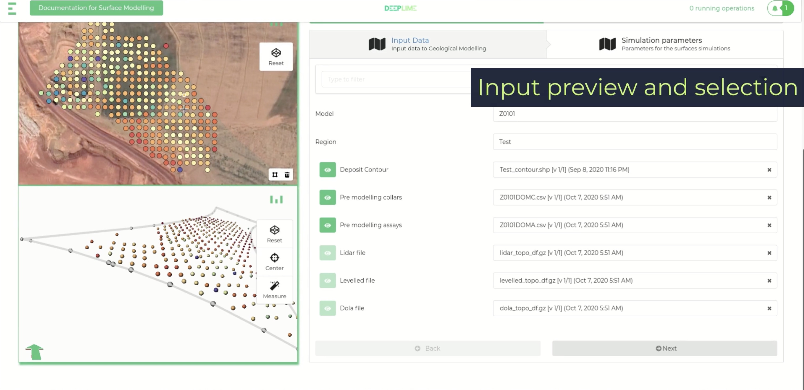

As a Developer at DeepLime, I spearheaded the development of GeoPortal, a sophisticated cloud-based platform that revolutionizes how geoscientists interact with and analyze geological data.

## Business Impact & Value

- **Enhanced Productivity**: Automated repetitive processes in resource estimation and reporting, significantly reducing manual workload
- **Streamlined Workflows**: Enabled geoscientists to build and deploy data-driven workflows with minimal technical overhead
- **System Integration**: Successfully integrated the platform with existing client data systems, ensuring seamless data flow and accessibility
- **Scalability**: Designed for scalability to handle large datasets and complex computations

## Technical Leadership & Achievements

### Design & Development

- Coordinated with cross-functional teams to align technical solutions with business requirements
- Designed intuitive dashboards for monitoring and managing data processing workflows
- Implemented advanced data visualization tools for 2D and 3D geological data analysis
- Integrated GIS capabilities for spatial data processing and visualization

### Key Features Delivered

- **Automated Workflow Engine**: Designed a flexible system for creating and deploying custom data processing pipelines
- **Interoperability**: Developed robust APIs and integration points for seamless connection with existing systems
- **Custom Analytics**: Created specialized tools for resource estimation and quality control
- **Reporting & Visualization**: Implemented interactive dashboards for data visualization and reporting

## Problem-Solving Approach

### Challenges Overcome

- **Data Volume**: Engineered solutions to handle massive geological datasets efficiently
- **System Complexity**: Simplified complex geological workflows through intuitive user interfaces
- **Integration**: Successfully bridged various data formats and systems used in the mining industry

### Innovation

- Developed novel approaches to automate traditional manual processes
- Created flexible architecture allowing for rapid customization per client needs
- Utilized cloud-native technologies for scalability and performance
- Ensured compliance with industry standards and regulations

## Technologies & Tools

### Core Stack

- Cloud Infrastructure (AWS/Azure)
- Modern Web Technologies for UI (React, Redux)
- Backend Services (Node.js)
- Python for Geological Data Processing and algorithms

### Development Practices

- Agile Development Methodology
- Code Review and Quality Assurance
- Documentation and Support
- Compliance with Industry Standards
- User Feedback and Iterative Development

## Measurable Outcomes

- **User Adoption**: Successfully deployed to multiple major mining companies
- **Client Satisfaction**: Received positive feedback from users on improved efficiency and ease of use
- **Processing Speed**: Achieved more than 5x faster data processing compared to traditional methods
- **System Reliability**: Maintained 99.9% uptime for critical operations

## Role & Responsibilities

- Led the core developments of the platform
- Collaborated with stakeholders to define product roadmap
- Mentored team members and established development standards

## Integration with GeoLime

GeoPortal works seamlessly with GeoLime, a Python library specialized in mining resource modeling, creating a comprehensive suite for geoscientific work.

## Future Development

Continuing to enhance the platform with:

- Enhanced reporting tools
- Expanded integration options
- Advanced AI capabilities
- Extended automation features
