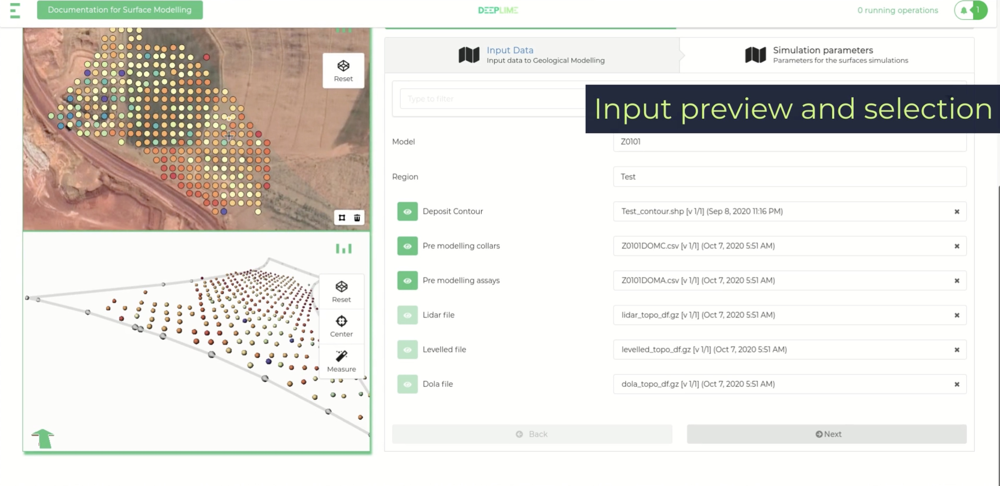

Geoscience software has a translation problem.

The data is spatial, heavy, and domain specific. The workflows live in specialist desktop tools or Python scripts that a geologist runs on a workstation overnight. GeoPortal brought that work into a corporate cloud platform, so mining and exploration teams could run heavy processing workflows - resource estimation, geostatistical simulation, block modeling - visualize the results in 3D, and share outputs without forcing every user into the same local setup.

## What the platform actually does

A resource estimation job is not a small computation. A geologist starts from drillhole data, validates it, runs a variogram analysis, kriges grades onto a block model that may contain tens of millions of cells, and produces a report that eventually feeds into a regulated resource statement. Steps can run for hours. Intermediate artifacts are large. Each stage is auditable.

GeoPortal wraps that kind of work in a web product:

- a workflow runner that orchestrates Python processing jobs in the cloud and surfaces their state
- 2D and 3D geological visualization for drillholes, surfaces, and block models inside the browser
- dashboards for monitoring processing status, inputs, outputs, and lineage
- GIS and spatial data workflows
- client-specific configuration for mining and exploration teams running on AWS or Azure

The bridge between the web product and the heavy Python tooling was the central piece. The UI had to show enough process state for a geologist to trust the number that came out the other end.

> "I am truly blown away by what you guys have created - I can't say it enough! To put it into some perspective for you, one person doing Grade Control models manually used to take around 6 weeks - 26 models would have taken 3 years to complete... without any holidays!"
>
> - Luke, Senior Resource Geologist at Alcoa

## The constraint

A generic dashboard is not enough for geological work.

A chart that ignores the underlying geology is decoration. A workflow runner that hides too much state is hard to trust when the output affects a resource statement or an operational decision worth tens of millions. Users need spatial context, processing state, data lineage, and results that still make sense to a domain expert who has been doing this work for twenty years.

The product had to simplify the surface without flattening the domain.

## The hard part

Two problems sat next to each other.

**Heavy computation through a thin UI.** A long-running Python job in the cloud is not a button click. Users need to know it started, how far it has progressed, what it produced, and what to do when it fails. We had to design progress, logs, and failure states that worked for both a geologist and an internal engineer debugging a pipeline.

**Client variance.** Different mining clients rarely have the same workflow. Too much customization creates a maintenance burden. Too little flexibility makes the platform unusable for real projects. The architecture had to leave room for client-specific setups while keeping the core interaction model consistent.

The useful design decisions came from sitting close to domain experts: which file formats they actually use, which coordinate systems matter, what they look at first when they review a block model, how they explain a result to a non-technical stakeholder.

## What I worked on

I worked on the web platform side of GeoPortal: the React/Redux frontend, the Node.js services that fronted the Python compute layer, and the 3D visualization work for drillholes and block models.

The geological processing libraries themselves were owned by the geoscience team - my job was to make their work usable inside a product.

## Stack

- React, Redux, TypeScript, and Three.js for 3D geological visualization
- Node.js backend services
- Python for geological data processing and resource estimation
- AWS and Azure depending on client context
- GIS and spatial data tooling
