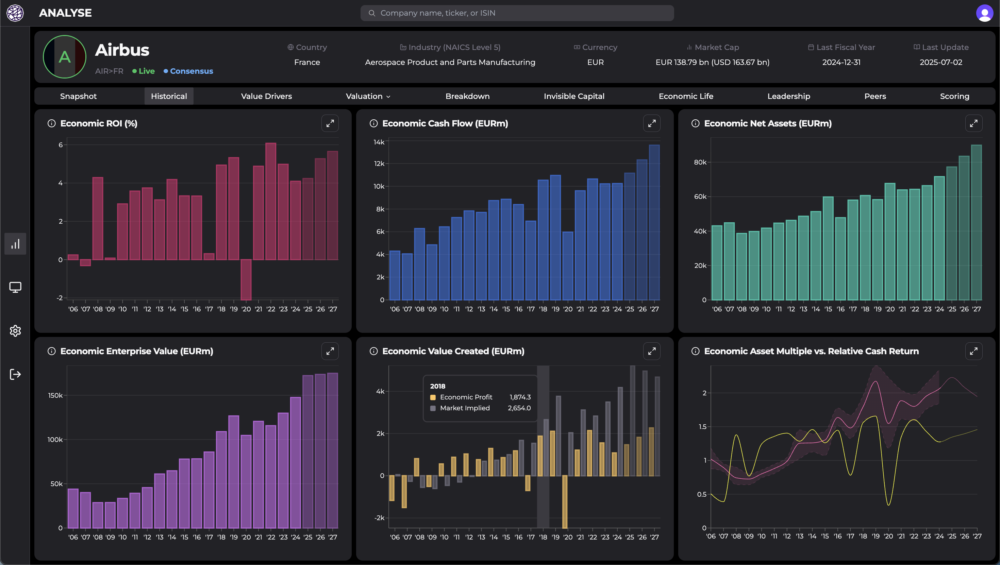

As the lead developer for Omaha Insights, I set out to create a next-generation financial data management and visualization platform tailored for finance professionals, analysts, and executives. My goal is to deliver actionable insights, robust analytics, and intuitive reporting tools—all within a seamless, modern user experience.

## My Role & Contributions

- **Product Design & Architecture**: Defined the user flows, and technical implementation.
- **Full-Stack Development**: Implemented core features using Next.js 14, TypeScript, and Tailwind CSS, ensuring a scalable and maintainable codebase.
- **Data Visualization**: Built interactive dashboards and charts with Recharts, enabling real-time KPI tracking and historical analysis.
- **UI/UX**: Leveraged Radix UI and Tailwind to deliver a consistent, accessible, and responsive interface across devices.
- **Testing & Quality**: Established testing conventions and CI pipelines to ensure reliability and maintainability.

## Business Value & Impact

- **Informed Decision-Making**: Omaha Insights empowers users to analyze company performance, benchmark against peers, and model financial scenarios for strategic planning.
- **Efficiency Gains**: Automated financial analysis, reporting, and peer comparison, significantly reducing manual effort and accelerating workflows.
- **Universal Accessibility**: Delivered a unified dashboard for all key financial metrics and analytics, accessible securely from any device.

## Key Features

- **Financial Analysis Dashboard**: Real-time KPIs, historical data visualization, and custom date range selection.
- **Peer Comparison**: Competitor benchmarking, industry-standard comparison, and performance gap analysis.
- **Valuation & Sensitivity Analysis**: Scenario testing, risk assessment, and projection modeling.
- **Data Tables & Reporting**: Customizable tables, export capabilities, sorting, filtering, and dynamic reporting.
- **Investment Screening**: Advanced filters, watchlist management, and reusable screening configurations.
- **Secure Authentication**: Role-based access control and session management via Clerk.

## Technical Stack & Implementation

- **Next.js 14**: Leveraged server-side rendering for fast load times and SEO optimization.
- **TypeScript**: Ensured type safety and long-term maintainability.
- **Tailwind CSS & Radix UI**: Enabled rapid, accessible, and consistent UI development.
- **Recharts**: Powered interactive and insightful data visualizations.
- **Clerk**: Provided robust authentication and access control.

## Challenges & Solutions

- **Scalability**: Architected the platform to handle large datasets and concurrent users efficiently.
- **Data Security**: Implemented strict access controls and secure data handling practices.
- **User Experience**: Focused on accessibility and responsiveness to ensure usability across all devices.

## Future Enhancements

- Expanding analytics and reporting capabilities.
- Deeper integration with external financial data sources.
- Advanced AI-driven insights and recommendations.
- Enhanced customization and user preferences.
