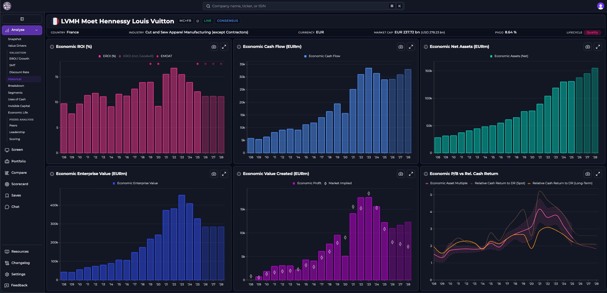

Finance software usually fails in one of two ways: it hides the model behind a pretty chart, or it exposes so much data that the user is back in a spreadsheet.

Omaha Insights sits between those two failure modes. It is a finance analytics platform for monitoring KPIs, comparing companies, working through valuation scenarios, and screening investment ideas. The interface has to let users move from question to evidence without losing the shape of the analysis.

## The constraint

Financial data is dense, but density is not the same as usefulness.

A KPI chart only helps if the user can see the period, the peer set, the source metric, and the next action. A screening table only helps if filters are visible enough to be trusted. A valuation view only helps if assumptions can be changed without turning the page into an Excel clone.

That shaped the product work. The problem was not "add more dashboards". It was deciding where the interface should reduce ambiguity and where it should expose it.

## Product shape

The platform brings together several workflows:

- KPI monitoring across historical periods
- peer comparison for benchmarking companies
- valuation and sensitivity analysis screens
- tables with sorting, filtering, and export-oriented behavior
- screening flows with reusable filter logic
- authenticated user sessions and saved workspaces

The important part is continuity. A user should be able to notice a metric, compare it against peers, inspect the underlying table, and continue the analysis without switching mental models on every page.

## The hard part

Finance tools are full of edge cases that look like UI details until they break trust.

Dates need to be explicit. Units need to be obvious. Empty states need to say whether data is missing, loading, filtered out, or genuinely unavailable. Tables need to be fast, but they also need to keep context when the user sorts, filters, or exports.

Most of the work is invisible when it is done well. The product feels calm because the state model underneath it is not leaking into the interface.

## Stack

- Next.js and TypeScript for the application layer
- Tailwind CSS and Radix UI for interface primitives
- Recharts for financial visualizations
- Clerk for authentication
- GCP for deployment and infrastructure pieces

## What still matters

The value of a finance interface is not the number of charts it can display. It is whether a user can trust the path from raw data to decision.

That means the UI has to make assumptions legible. It should show what changed, what is missing, what is comparable, and what is only a starting point for analysis.
