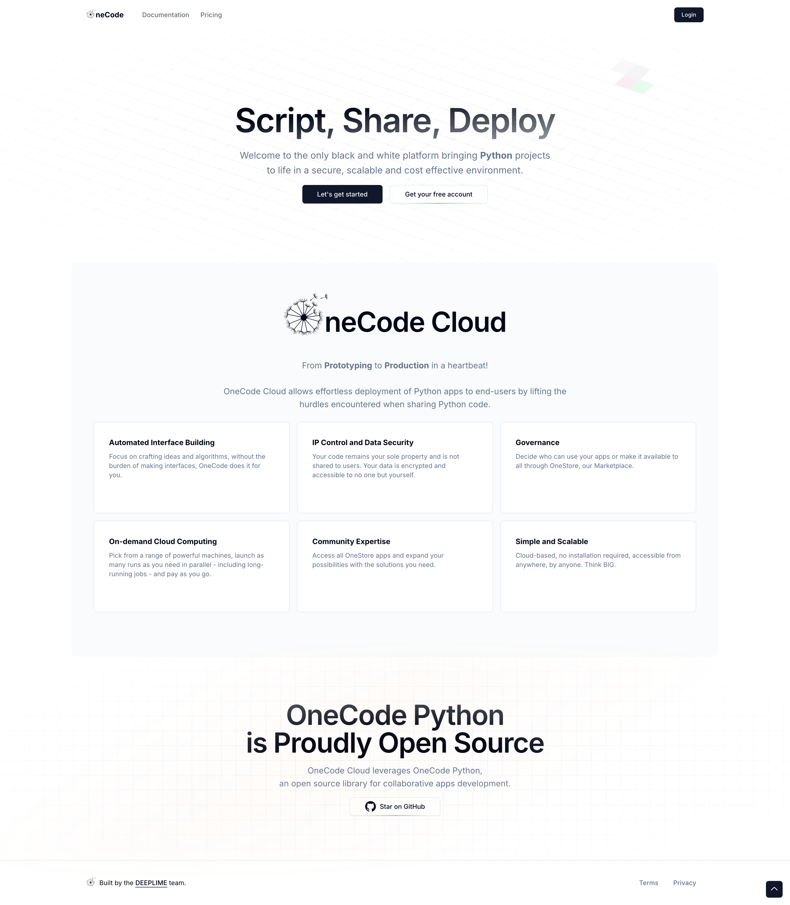

I developed the OneCode Cloud Platform, a sophisticated web application that enables seamless deployment and management of Python applications. This platform serves as the cornerstone of the OneCode ecosystem, providing users with a streamlined interface for deploying their Python scripts.

OneCode is an open-source library developed by DeepLime designed to facilitate easy collaborative Python development. It allows for the versatile execution of applications and teams up with OneCode Cloud, a web platform that enables the secure, scalable, and cost-effective deployment of Python applications to end-users. This platform provides a user-friendly interface for deploying scripts without requiring extensive coding changes.

## Business Value and Impact

The OneCode Cloud Platform significantly reduces the time and effort required to deploy Python applications, enabling businesses to bring their products to market faster. By providing a secure and scalable infrastructure, it ensures that applications can handle varying loads and maintain high availability, which is crucial for business continuity and customer satisfaction.

For example, a client was able to reduce their deployment time from weeks to days, allowing them to quickly respond to market demands and improve their competitive edge.

## Problem-Solving Approach and Key Challenges Overcome

### Problem-Solving Approach

- **Modern Web Architecture**: Built a robust web application using Next.js and TypeScript to ensure high performance and maintainability.
- **Cloud Integration**: Leveraged AWS services to create a secure and scalable cloud infrastructure.
- **User Authentication**: Developed a comprehensive authentication system with role-based access control to ensure secure access to the platform.
- **Automated Deployment**: Implemented a CI/CD pipeline to streamline the deployment process and reduce manual intervention.

### Key Challenges Overcome

- **Scalability**: Designed a cloud architecture that can automatically scale to handle varying loads, ensuring consistent performance.
- **Security**: Integrated AWS Cognito for secure user authentication and authorization, protecting sensitive data.
- **User Experience**: Created an intuitive and responsive user interface that works seamlessly across all devices.

## My Role and Responsibilities

As a lead developer in this project, I was responsible for:

- Selecting the appropriate technologies.
- Designing and implementing the core features.
- Adhering to best practices.
- Delivering the project on time.

## Technologies Used

- **Next.js**: For a modern web architecture and optimal performance.
- **TypeScript**: For type safety and code reliability.
- **AWS Lambda**: For serverless computing and cost-effective scaling.
- **AWS Cognito**: For secure user authentication and authorization.
- **AWS S3**: For scalable file storage and retrieval.

## Future Enhancements

Planned improvements include:

- Enhanced monitoring and analytics
- Advanced collaboration features
- Extended integration capabilities
- Performance optimization
- Marketplace for sharing Python applications

## Conclusion

The OneCode Cloud Platform is now a powerful tool for deploying and managing Python applications, offering a secure, scalable, and user-friendly solution. By leveraging modern web technologies and cloud services, it addresses key challenges in application deployment and provides significant business value. Future enhancements will continue to improve the platform's capabilities, ensuring it remains a valuable asset for developers and businesses alike.

## Related Links

[OneCode Cloud Platform](https://www.onecode.rocks): The official website for the OneCode Cloud Platform

[OneCode GitHub Repository](https://github.com/deeplime-io/onecode): The source code for the OneCode Python library

[DeepLime Official Website](https://www.deeplime.io): Learn more about DeepLime and their projects
