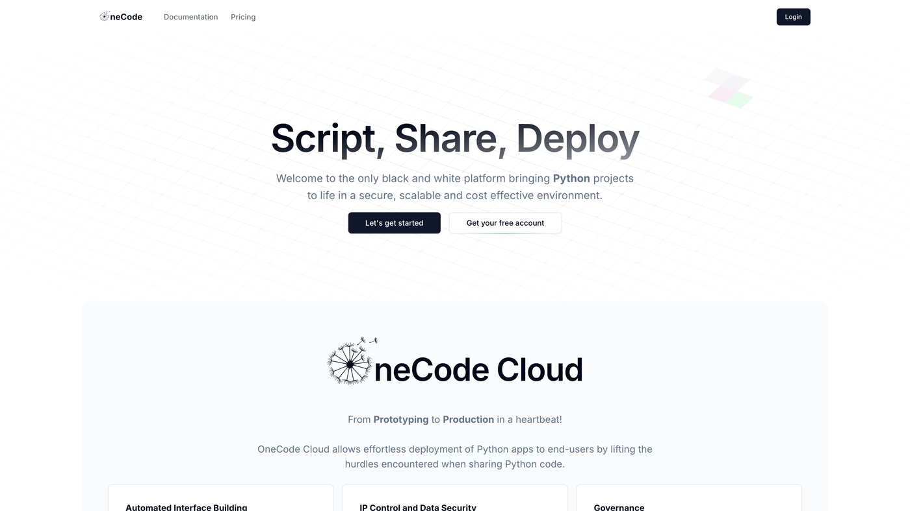

Data science tools often stop one step before they become useful to the rest of a company.

A Python workflow may run on a developer's machine, but that does not mean a business user can open it, share it, execute it safely, or understand why it failed. OneCode Cloud was built to close that gap: a web platform for deploying Python applications from the OneCode ecosystem without asking every team to become a cloud infrastructure team.

## The constraint

The product had to hide cloud complexity without lying about it.

A deployment flow can look simple on the surface, but the system still needs workspaces, permissions, storage, execution limits, logs, failures, and cleanup. If those states are hidden too aggressively, users lose trust when something goes wrong. If they are exposed too directly, the product becomes an AWS console with different colors.

The interface had to make deployment feel approachable while keeping the operational model visible enough to debug.

## System shape

The platform wrapped Python applications in a managed product surface:

- workspace and project organization
- deployment management from a Next.js interface
- AWS serverless execution paths
- authentication and authorization through Cognito
- deployment artifacts and file storage in S3
- CI/CD and testing conventions for a production app

The important design choice was isolation. Each app needed a clear execution context, and each user action needed to respect workspace boundaries.

## The hard part

The boundary between "simple" and "misleading" is thin in cloud products.

Users should not have to think about Lambda configuration to deploy a small Python app. But when an execution fails, the product has to show enough information to explain the failure. That means logs, status transitions, permissions, and artifact state cannot be afterthoughts.

The system needed to translate infrastructure events into product language without erasing the infrastructure underneath.

## Stack

- Next.js, React, TypeScript, and Tailwind CSS
- AWS Lambda, S3, Cognito, and PostgreSQL
- GitHub Actions for automated testing and deployment
- OneCode Python library as the execution ecosystem

## Links

- [OneCode Cloud Platform](https://www.onecode.rocks)
- [OneCode GitHub repository](https://github.com/deeplime-io/onecode)
- [DeepLime](https://www.deeplime.io)
