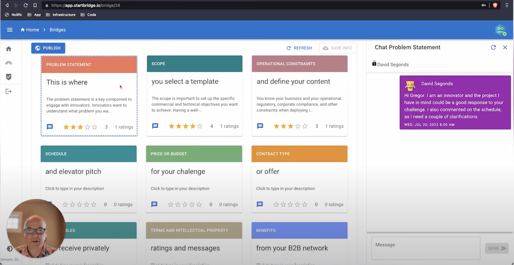

As a contractor for StartBridge, I worked on a marketplace platform for innovation projects.

The product helps innovators create offers or project calls, gather feedback from their professional network, and prepare launches on the marketplace. My work focused on translating business requirements into usable React interfaces.

## What I worked on

- Updated Figma designs as requirements evolved
- Built React interfaces with Material UI
- Implemented project pages for innovation offers and calls
- Worked on real-time communication features
- Collaborated directly with the CTO on product and technical decisions

## The hard parts

The platform had to support users who were not necessarily technical, while still handling a lot of business-specific language around innovation projects, stakeholders, and marketplace readiness.

The main engineering challenge was integrating new features into an existing codebase without making the interface harder to maintain.

## What it says about my work

- Contractor experience with direct stakeholder communication
- React implementation inside an existing product
- Ability to work from Figma to production UI
- Product sensitivity around marketplace workflows
- Comfortable collaboration with a CTO and small team

## Stack

- React
- React Query
- Material UI

  <iframe
    style="position: absolute; top: 0; left: 0; width: 100%; height: 100%;"
    src="https://www.youtube.com/embed/v4jvRmYv5R0"
    frameborder="0"
    allow="accelerometer; autoplay; clipboard-write; encrypted-media; gyroscope; picture-in-picture"
    allowfullscreen
  ></iframe>

